# AI Architecture

## AI Business Decision Intelligence Platform

Document status: Initial AI architecture  
Prepared on: 2026-07-06  
Version: 0.1  
Scope: AI pipeline, ingestion, ETL, feature engineering, embeddings, vector database, knowledge graph, multi-agent framework, LLM layer, explainability layer, and specialist AI agents.

---

## 1. AI Architecture Goals

The AI architecture must turn raw business data into explainable decisions. It should combine deterministic analytics, machine learning, retrieval-augmented generation, multi-agent reasoning, and governed LLM usage.

Primary goals:

- Discover insights across structured and unstructured data.
- Explain why business changes happened.
- Forecast likely future outcomes.
- Simulate possible business actions.
- Recommend evidence-backed strategies.
- Keep every AI output auditable, permission-aware, and explainable.
- Learn from user feedback and business outcomes over time.

---

## 2. End-to-End AI Pipeline

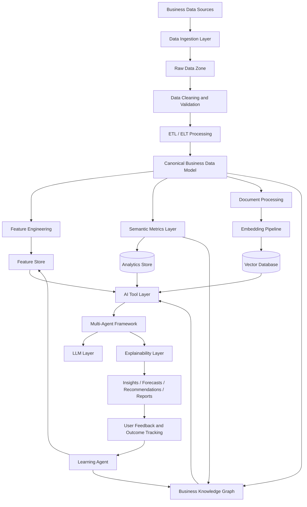

### 2.1 Pipeline Stages

| Stage | Purpose | Output |
|---|---|---|
| Data ingestion | Bring data from files, APIs, databases, and SaaS apps | Raw source records and ingestion metadata |
| Data cleaning | Detect errors, missing values, duplicates, outliers, and invalid formats | Cleaned and quality-scored records |
| ETL / ELT | Transform source-specific data into canonical business entities | Normalized facts, dimensions, and document metadata |
| Feature engineering | Generate ML-ready features for forecasting, risk, segmentation, and recommendations | Feature tables and feature definitions |
| Embedding pipeline | Convert unstructured and semantic content into vector representations | Embeddings with metadata and access filters |
| Knowledge graph | Represent business entities, relationships, metrics, documents, decisions, and outcomes | Graph-based business context |
| Multi-agent reasoning | Coordinate specialist AI agents and governed tools | Agent plans, intermediate results, and final outputs |
| Explainability | Attach evidence, confidence, caveats, and lineage | Trustworthy AI results |
| Learning loop | Learn from user feedback and measured outcomes | Improved ranking, prompts, features, and policies |

---

## 3. Data Ingestion

### 3.1 Sources

| Source Type | Examples | Initial Priority |
|---|---|---|
| File uploads | CSV, XLSX, PDF, DOCX, TXT | High |
| Spreadsheets | Google Sheets, Excel exports | High |
| CRM | HubSpot, Salesforce, Zoho CRM | Medium |
| Finance | QuickBooks, Xero, Stripe | Medium |
| Ecommerce | Shopify, WooCommerce, Amazon Seller | Medium |
| Marketing | Google Ads, Meta Ads, GA4 | Medium |
| Support | Zendesk, Freshdesk, Intercom | Medium |
| Databases | PostgreSQL, MySQL, SQL Server | Later |
| Warehouses | Snowflake, BigQuery, Databricks | Later |
| External context | Market reports, news, benchmark datasets | Later |

### 3.2 Ingestion Flow

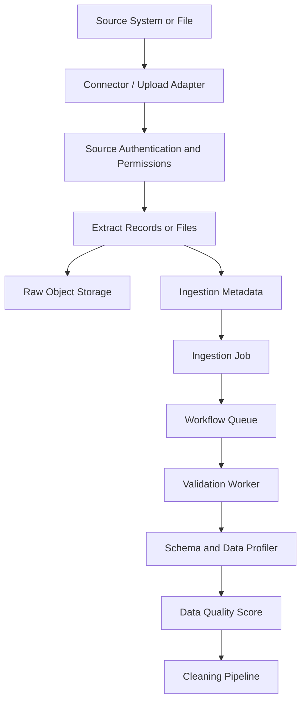

### 3.3 Ingestion Requirements

- Every ingestion job must be tenant-scoped.
- Raw data should be preserved for traceability and reprocessing.
- Source credentials must be encrypted and stored in a secret manager.
- Incremental sync should use source cursors where available.
- Schema drift must be detected and reported.
- All ingestion activity must emit audit events.
- Failed rows should be quarantined instead of silently dropped.

---

## 4. ETL / ELT Architecture

ETL converts heterogeneous source data into a canonical business model. For large sources, ELT should load first into analytical storage and transform there.

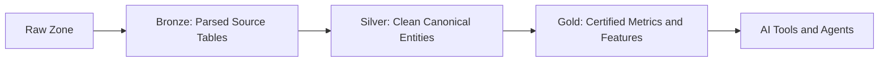

### 4.1 Processing Layers

| Layer | Description | Example |
|---|---|---|
| Raw | Original source files and payloads | Uploaded sales CSV |
| Bronze | Parsed and typed source records | `shopify_orders_bronze` |
| Silver | Cleaned canonical entities | `orders`, `customers`, `transactions` |
| Gold | Business metrics, aggregates, and features | `monthly_recurring_revenue`, `churn_risk_features` |

### 4.2 Canonical Business Model

| Domain | Entities |
|---|---|
| Sales | Lead, opportunity, deal, pipeline stage, revenue |
| Customer | Account, contact, segment, cohort, lifecycle stage |
| Finance | Invoice, payment, expense, margin, cash flow |
| Marketing | Campaign, channel, spend, impressions, conversion |
| Operations | Order, inventory, fulfillment, SLA, capacity |
| Support | Ticket, sentiment, issue category, resolution |
| Documents | File, document, chunk, citation, extraction |
| Decision | Insight, recommendation, scenario, action, outcome |

### 4.3 ETL Quality Gates

| Gate | Rule |
|---|---|
| Schema validation | Required columns, types, and formats must match expectations |
| Identity resolution | Customers, accounts, products, and campaigns must be matched or flagged |
| Duplicate detection | Duplicate records must be merged, quarantined, or marked |
| Referential integrity | Facts must map to valid dimensions where possible |
| Freshness checks | Late or stale data must be visible to AI agents |
| PII classification | Sensitive fields must be tagged before indexing or prompting |
| Metric validation | Certified metrics must use approved formulas |

---

## 5. Feature Engineering

Feature engineering prepares structured signals for forecasting, risk detection, root cause analysis, recommendation ranking, and segmentation.

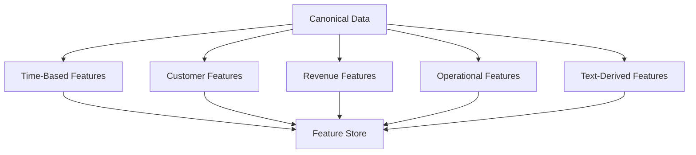

### 5.1 Feature Categories

| Category | Example Features | Used By |
|---|---|---|
| Time-series | Lag values, moving averages, seasonality, trend slope | Forecasting Agent |
| Customer | Tenure, segment, activity frequency, lifecycle stage | Risk Agent, Recommendation Agent |
| Revenue | MRR, ARPU, margin, discount rate, payment delays | Forecasting Agent, Root Cause Agent |
| Marketing | CAC, conversion rate, spend efficiency, campaign age | Recommendation Agent |
| Operations | Fulfillment time, backlog, inventory turnover, SLA breach rate | Root Cause Agent, Risk Agent |
| Support | Ticket volume, time to resolution, sentiment score | Sentiment Agent, Risk Agent |
| Text-derived | Topic, intent, urgency, complaint category, entity mentions | Sentiment Agent, Executive Report Agent |
| Data quality | Completeness, freshness, drift, anomaly score | Explainability Layer |

### 5.2 Feature Store Requirements

- Feature definitions must be versioned.
- Features must include tenant, source, freshness, and lineage metadata.
- Training and inference features must be consistent.
- Sensitive features must be tagged and access-controlled.
- Feature drift must be monitored.

---

## 6. Embedding Pipeline

The embedding pipeline converts documents, user questions, metric definitions, insight history, and semantic entities into searchable vector representations.

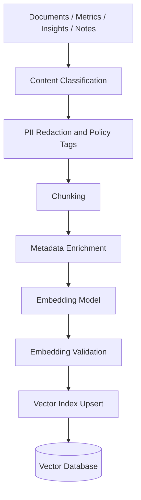

### 6.1 Embedding Inputs

| Input | Purpose |
|---|---|
| Business documents | Retrieve relevant context for advisor answers |
| Customer feedback | Detect sentiment, themes, objections, and churn risks |
| Metric definitions | Ground natural language questions in certified metrics |
| Prior insights | Reuse historical analysis and avoid repeated work |
| Decisions and outcomes | Learn from previous recommendations |
| Data dictionary | Map business terms to fields and entities |

### 6.2 Chunking Strategy

| Content Type | Chunking Strategy |
|---|---|
| PDF reports | Section-aware chunks with heading hierarchy |
| Support tickets | One ticket or conversation segment per chunk |
| Meeting notes | Topic or agenda-based chunks |
| Metric definitions | One metric per chunk with formula and owner |
| Long documents | Recursive chunks with overlap and page references |
| Tables | Preserve row/column context and table title |

### 6.3 Embedding Metadata

Every vector record should include:

- Tenant ID and workspace ID.
- Source document or object ID.
- Chunk ID and source location.
- Data classification.
- Access policy tags.
- Content type.
- Created and updated timestamps.
- Embedding model and version.
- Language.
- Confidence or extraction quality where available.

---

## 7. Vector Database

The vector database powers semantic retrieval for RAG, document intelligence, metric matching, insight recall, and decision memory.

### 7.1 Recommended Strategy

| Stage | Technology | Reason |
|---|---|---|
| MVP | pgvector | Simpler operations, tenant metadata near PostgreSQL records |
| Scale | Qdrant | Dedicated vector search, collections, filtering, performance |
| Enterprise | Per-tenant collection or dedicated vector cluster | Stronger isolation and compliance |

### 7.2 Vector Retrieval Flow

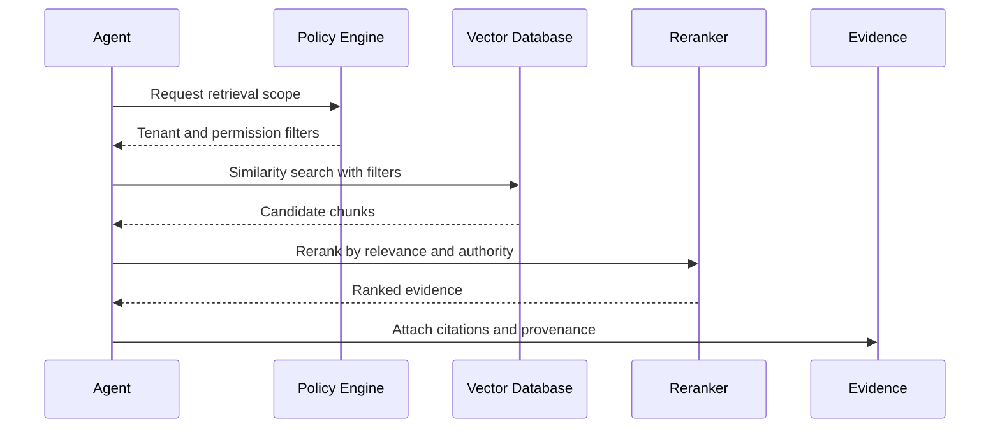

### 7.3 Retrieval Controls

- Mandatory tenant and workspace filters.
- Data classification filtering before retrieval.
- Role-based document access.
- Maximum chunks per answer.
- Reranking by relevance, recency, source authority, and citation quality.
- Prompt-injection scanning for retrieved content.
- Retrieval quality score included in final confidence.

---

## 8. Knowledge Graph

The knowledge graph represents the business as connected entities, metrics, documents, insights, recommendations, and outcomes.

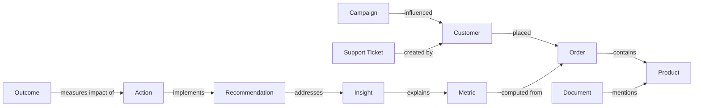

### 8.1 Graph Node Types

| Node | Examples |
|---|---|
| Business entities | Customer, product, campaign, supplier, region |
| Metrics | Revenue, churn, CAC, conversion rate, margin |
| Events | Order placed, ticket opened, campaign launched |
| Documents | Report, feedback, contract, meeting note |
| Insights | Anomaly, trend, root cause, risk |
| Recommendations | Price change, campaign adjustment, retention action |
| Decisions | Accepted, rejected, deferred recommendation |
| Outcomes | KPI movement after action |

### 8.2 Knowledge Graph Uses

- Improve context retrieval.
- Support root-cause traversal.
- Connect documents to business entities.
- Store decision history.
- Explain relationships between metrics and actions.
- Enable graph-based risk propagation.
- Support executive reports with business lineage.

### 8.3 Storage Strategy

| Stage | Storage |
|---|---|
| MVP | PostgreSQL relational tables with graph-like edges |
| Growth | PostgreSQL plus materialized relationship views |
| Scale | Neo4j, Memgraph, or graph extension if traversal complexity grows |

---

## 9. Multi-Agent Framework

The platform uses a supervised multi-agent architecture. A supervisor agent decomposes business questions into tasks, assigns specialist agents, coordinates tools, validates outputs, and produces a final evidence-backed result.

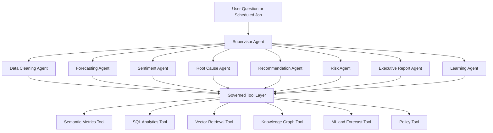

### 9.1 Framework Requirements

- Agent workflows must be stateful and traceable.
- Each agent must have a bounded responsibility.
- Agents must use governed tools instead of direct unrestricted access.
- Supervisor must validate data permissions before invoking tools.
- Intermediate outputs must be stored for audit and debugging.
- Human approval must be required for external business actions.
- Agent performance must be evaluated with task-specific metrics.

### 9.2 Agent State

| State Item | Purpose |
|---|---|
| User question or trigger | Defines task objective |
| Tenant and role context | Enforces permissions |
| Relevant metrics | Grounds analysis |
| Retrieved evidence | Supports answer |
| Tool calls | Enables audit and debugging |
| Intermediate findings | Allows explainability |
| Confidence scores | Communicates uncertainty |
| Final recommendation | User-facing decision support |
| Feedback | Learning and evaluation |

---

## 10. LLM Layer

The LLM layer abstracts model providers and centralizes routing, safety, cost control, prompt management, and evaluation.

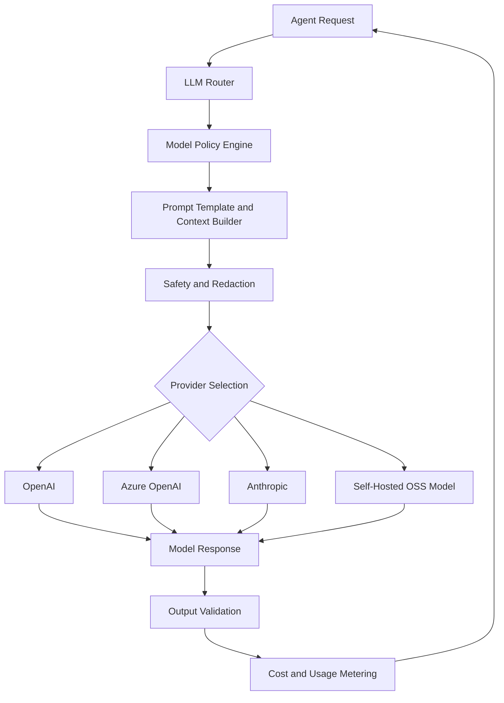

### 10.1 LLM Layer Responsibilities

| Responsibility | Description |
|---|---|
| Provider abstraction | Route to OpenAI, Azure OpenAI, Anthropic, Gemini, or OSS models |
| Model selection | Choose model by task complexity, latency, cost, and sensitivity |
| Prompt management | Version prompts and system instructions |
| Context construction | Assemble metric, document, graph, and user context |
| Safety | Redact sensitive data and block unsafe outputs |
| Structured output | Enforce JSON/schema outputs for agent-to-agent communication |
| Cost control | Track tokens, budgets, and tenant quotas |
| Evaluation | Log outputs for quality review and automated tests |
| Fallbacks | Retry, degrade, or switch provider when safe |

### 10.2 Model Routing Policy

| Task | Model Class |
|---|---|
| Simple classification | Small low-cost model |
| Sentiment and topic extraction | Small or medium model |
| SQL planning | Strong reasoning model with schema grounding |
| Executive summaries | High-quality language model |
| Root-cause synthesis | Strong reasoning model |
| Recommendation ranking | Strong reasoning model plus deterministic scoring |
| Sensitive enterprise data | Approved private or regional model endpoint |

---

## 11. Explainability Layer

The explainability layer converts AI outputs into trusted business explanations.

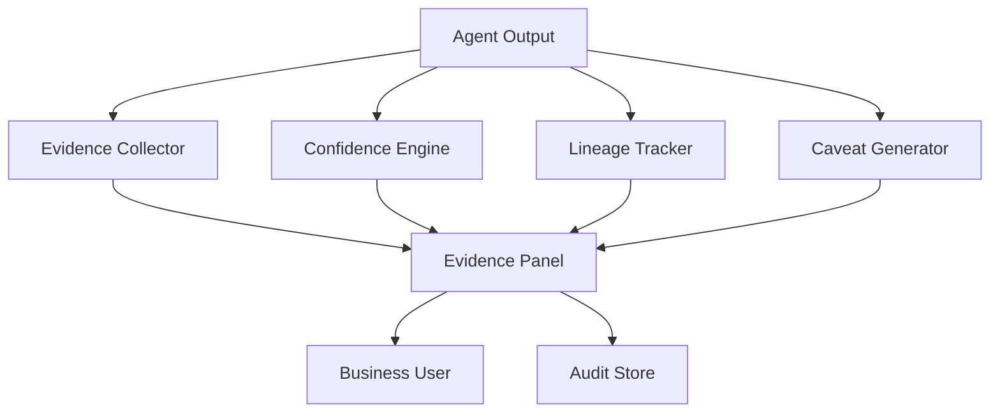

### 11.1 Explainability Outputs

| Output | Description |
|---|---|
| Source evidence | Rows, metrics, documents, chunks, and queries supporting answer |
| Metric lineage | Formula, source, owner, grain, freshness |
| Model lineage | Model provider, model version, prompt version, tool versions |
| Confidence score | Combined certainty from data, retrieval, statistics, and model checks |
| Assumptions | Explicit assumptions used in forecasts or scenarios |
| Caveats | Missing data, stale data, weak evidence, or high uncertainty |
| Counter-evidence | Evidence that weakens or challenges the conclusion |
| Audit trace | Full internal reasoning and tool-call trace for authorized users |

### 11.2 Composite Confidence Score

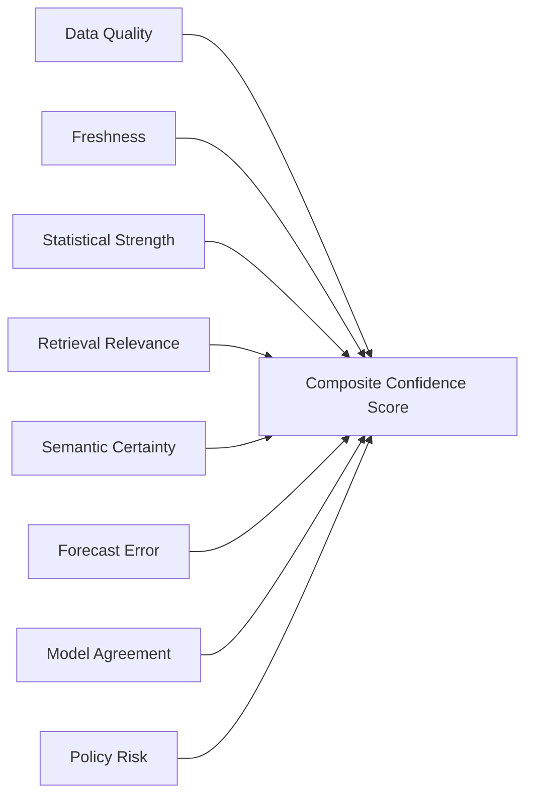

| Factor | Meaning |
|---|---|
| Data quality | Completeness, duplicates, invalid values, schema drift |
| Freshness | Whether data is recent enough for the decision |
| Statistical strength | Significance, effect size, sample size |
| Retrieval relevance | Similarity, rerank score, source authority |
| Semantic certainty | Confidence that business terms map to certified metrics |
| Forecast error | Historical model error and uncertainty interval |
| Model agreement | Agreement across models or agent self-checks |
| Policy risk | Sensitivity, privacy, or access concerns |

---

## 12. AI Agents

### 12.1 Agent Catalog

| Agent | Primary Responsibility | Main Outputs |
|---|---|---|
| Data Cleaning Agent | Detect and fix data quality issues | Cleaning report, quality score, remediation suggestions |
| Forecasting Agent | Predict future metric trends | Forecasts, confidence intervals, assumptions |
| Sentiment Agent | Analyze customer and document sentiment | Sentiment trends, topics, risks |
| Root Cause Agent | Explain why metrics changed | Ranked drivers, evidence, confidence |
| Recommendation Agent | Suggest actions | Recommended actions, impact, risk, effort |
| Risk Agent | Identify business, data, and operational risks | Risk register, severity, mitigation |
| Executive Report Agent | Create leadership-ready narratives | Executive summaries, board-style reports |
| Learning Agent | Learn from feedback and outcomes | Updated recommendation weights, evaluation records |

### 12.2 Data Cleaning Agent

| Aspect | Design |
|---|---|
| Purpose | Ensure downstream AI does not reason over broken or misleading data |
| Inputs | Raw records, schema profiles, source metadata, business rules |
| Tools | Profiler, deduplication tool, PII classifier, schema mapper, anomaly detector |
| Outputs | Data quality score, issue list, cleaned dataset, quarantine records |
| Human review | Required for destructive fixes, ambiguous mappings, and PII policy changes |

Responsibilities:

- Detect missing values, invalid types, duplicates, outliers, and schema drift.
- Recommend column mappings to canonical entities.
- Classify PII and sensitive business fields.
- Quarantine suspicious rows.
- Generate a data-readiness report for AI agents.

### 12.3 Forecasting Agent

| Aspect | Design |
|---|---|
| Purpose | Forecast key metrics and quantify uncertainty |
| Inputs | Certified metrics, historical facts, features, calendar events, assumptions |
| Tools | Time-series model tool, feature store, backtesting tool, scenario tool |
| Outputs | Forecast values, confidence intervals, model error, assumptions |
| Human review | Required for strategic decisions based on high-uncertainty forecasts |

Responsibilities:

- Select appropriate forecast model by data volume and seasonality.
- Backtest models and report error.
- Generate baseline, optimistic, and conservative projections.
- Explain drivers influencing forecast direction.
- Provide uncertainty intervals rather than single-point predictions only.

### 12.4 Sentiment Agent

| Aspect | Design |
|---|---|
| Purpose | Extract customer sentiment, themes, urgency, and business signals from text |
| Inputs | Reviews, tickets, survey responses, emails, call notes, documents |
| Tools | Text classifier, topic model, embedding retrieval, entity extractor |
| Outputs | Sentiment score, themes, topic trends, example citations |
| Human review | Required before using private communications in broad reports |

Responsibilities:

- Classify sentiment by customer, product, channel, region, and time.
- Detect emerging complaints and praise themes.
- Link sentiment shifts to churn, support load, and revenue metrics.
- Provide representative citations.
- Detect emotionally charged or high-risk customer issues.

### 12.5 Root Cause Agent

| Aspect | Design |
|---|---|
| Purpose | Identify likely reasons behind metric changes |
| Inputs | Metric deltas, dimensions, feature store, documents, events, graph context |
| Tools | Driver analysis, cohort comparison, causal hypothesis tool, graph traversal, RAG |
| Outputs | Ranked root-cause hypotheses, evidence, counter-evidence, confidence |
| Human review | Required for high-impact causal claims |

Responsibilities:

- Decompose metric changes by segment, channel, product, geography, and cohort.
- Distinguish correlation from causal hypothesis.
- Search documents for supporting business context.
- Identify missing data that prevents a stronger conclusion.
- Provide counterfactual or alternative explanations when possible.

### 12.6 Recommendation Agent

| Aspect | Design |
|---|---|
| Purpose | Recommend practical business actions based on evidence |
| Inputs | Insights, root causes, forecasts, scenarios, risk constraints, business goals |
| Tools | Action catalog, impact estimator, risk scorer, scenario simulator |
| Outputs | Ranked actions, expected impact, effort, risk, confidence |
| Human review | Required before executing or assigning actions |

Responsibilities:

- Convert insights into concrete actions.
- Rank actions by expected impact, effort, risk, cost, and time-to-value.
- Explain why an action is recommended.
- Suggest experiments where confidence is moderate.
- Track accepted, rejected, or deferred recommendations.

### 12.7 Risk Agent

| Aspect | Design |
|---|---|
| Purpose | Identify risks in business metrics, operations, data quality, and AI outputs |
| Inputs | Forecasts, anomalies, data quality reports, documents, policies |
| Tools | Risk scoring model, anomaly detector, compliance policy tool, graph traversal |
| Outputs | Risk register, severity, likelihood, impact, mitigation |
| Human review | Required for compliance, legal, financial, or customer-impact risks |

Responsibilities:

- Detect business risks such as churn, margin compression, cash-flow stress, and operational delays.
- Detect data risks such as stale data, missing sources, and schema drift.
- Detect AI risks such as weak evidence or policy-sensitive recommendations.
- Prioritize risks by likelihood and business impact.
- Recommend mitigations and monitoring triggers.

### 12.8 Executive Report Agent

| Aspect | Design |
|---|---|
| Purpose | Convert analysis into leadership-ready summaries |
| Inputs | Insights, recommendations, forecasts, KPIs, evidence, risk register |
| Tools | Narrative generator, chart summarizer, citation selector, report template engine |
| Outputs | Executive summary, weekly report, board-style narrative, action plan |
| Human review | Recommended before external sharing |

Responsibilities:

- Summarize what changed, why it matters, what is next, and what to do.
- Generate concise executive-ready narratives.
- Highlight confidence, risks, and open questions.
- Include evidence references without overwhelming the reader.
- Tailor reports by audience: founder, sales leader, finance, operations, board.

### 12.9 Learning Agent

| Aspect | Design |
|---|---|
| Purpose | Improve recommendations and AI workflows from feedback and outcomes |
| Inputs | User feedback, accepted/rejected recommendations, KPI outcomes, agent traces |
| Tools | Evaluation store, outcome attribution model, prompt evaluation, ranking model |
| Outputs | Updated recommendation weights, evaluation labels, improvement suggestions |
| Human review | Required before changing certified metrics, policies, or production agent behavior |

Responsibilities:

- Track whether recommendations were accepted, rejected, modified, or ignored.
- Compare expected impact with actual outcomes.
- Identify which agents or prompts produced low-quality results.
- Improve recommendation ranking over time.
- Suggest new business rules, metrics, or templates.

---

## 13. Agent Collaboration Patterns

### 13.1 Scheduled Insight Pattern

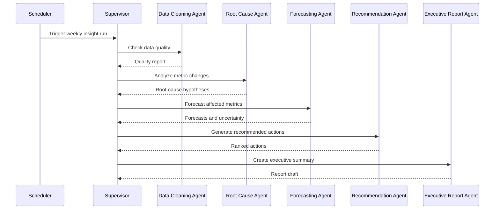

### 13.2 User Question Pattern

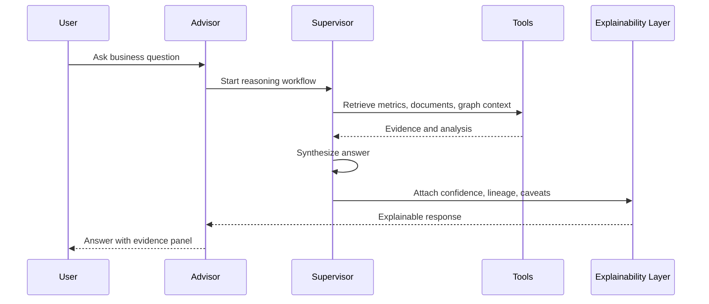

---

## 14. AI Governance and Monitoring

### 14.1 AI Monitoring Metrics

| Metric | Purpose |
|---|---|
| Answer acceptance rate | Measures perceived usefulness |
| Evidence view rate | Measures trust engagement |
| Recommendation acceptance rate | Measures business actionability |
| Forecast error | Measures predictive quality |
| Root-cause validation rate | Measures explanation usefulness |
| Hallucination incident rate | Measures AI safety |
| Tool failure rate | Measures agent reliability |
| Token cost per insight | Measures unit economics |
| Retrieval precision | Measures RAG quality |
| Policy block rate | Measures governance friction |

### 14.2 AI Audit Events

- User question or scheduled trigger.
- Agent workflow ID.
- Agent versions and prompt versions.
- Tool calls and parameters.
- Retrieved document chunk IDs.
- SQL query IDs or metric query IDs.
- Model provider and model version.
- Token usage and cost.
- Confidence score.
- Final answer and evidence references.
- User feedback and outcome tracking.

---

## 15. Failure Modes and Safeguards

| Failure Mode | Safeguard |
|---|---|
| Hallucinated metric | Require certified semantic metric lookup |
| Cross-tenant data leak | Mandatory tenant filters in every tool |
| Prompt injection from document | Treat retrieved text as untrusted; strip instructions and policy-check output |
| Low-quality data | Block or degrade answer with visible caveats |
| Overconfident forecast | Always include uncertainty and historical error |
| False root cause | Present ranked hypotheses and counter-evidence |
| Bad recommendation | Require human approval and show risk/effort/impact |
| Excess model cost | Model routing, quotas, caching, and budgets |
| Agent loop or runaway task | Step limits, timeouts, and workflow cancellation |
| Silent failed ingestion | Job monitoring, alerts, and quarantine reports |

---

## 16. Recommended Implementation Phases

| Phase | AI Capability |
|---|---|
| Phase 1 | Ingestion, data cleaning, semantic metrics, basic advisor Q&A |
| Phase 2 | Embedding pipeline, vector search, document intelligence, evidence panel |
| Phase 3 | Forecasting agent, sentiment agent, root-cause agent |
| Phase 4 | Recommendation agent, risk agent, executive report agent |
| Phase 5 | Knowledge graph, decision memory, learning agent |
| Phase 6 | Advanced scenario simulation, causal inference, autonomous monitoring |

---

## 17. Summary

The AI architecture should be built around governed, explainable decision intelligence rather than generic chat. The core foundation is an end-to-end pipeline that ingests business data, cleans and normalizes it, builds features and embeddings, organizes context in a vector database and knowledge graph, and lets specialist agents reason through governed tools.

The platform's AI differentiation comes from the collaboration between the Data Cleaning, Forecasting, Sentiment, Root Cause, Recommendation, Risk, Executive Report, and Learning Agents. Together, they support a complete decision workflow: understand the data, explain the change, predict what comes next, evaluate risk, recommend action, communicate clearly, and learn from outcomes.
