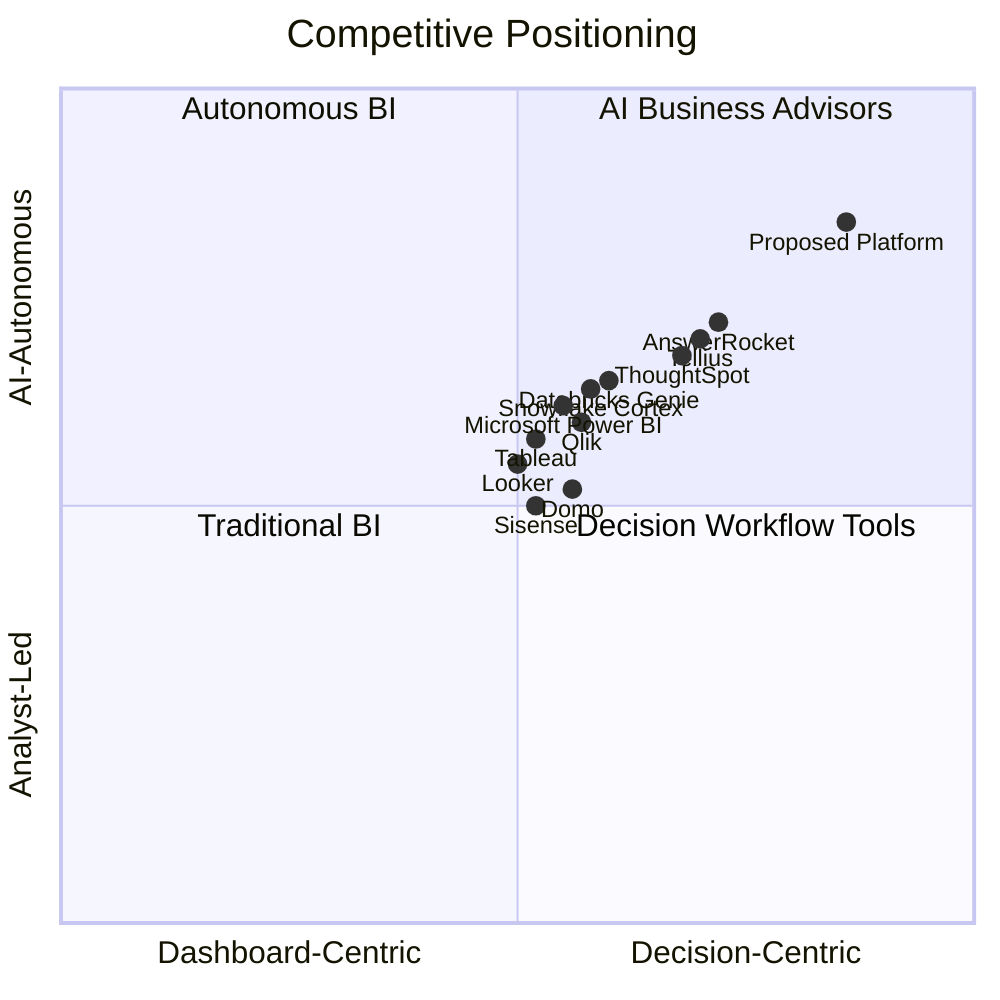

# Competitive Analysis and Novelty Report

## AI Business Decision Intelligence Platform

Document status: Initial strategic analysis  
Prepared on: 2026-07-06  
Version: 0.1  
Scope: Competitors, feature comparison, SWOT, industry gaps, limitations, high-level patent landscape, research gaps, novelty opportunities, USP, patentable innovation candidates, and IEEE publication topics.

> Note: The patent section is a strategic overview, not legal advice. Patentability and freedom-to-operate require a formal search and review by qualified IP counsel.

---

## 1. Executive Summary

The analytics market is shifting from dashboard-centric BI toward AI-assisted decision intelligence. Major incumbents now offer natural language querying, copilots, automated insights, forecasting, and embedded AI features. However, most products still concentrate on reporting, visualization, and analyst acceleration rather than autonomous, evidence-backed business advisory workflows.

The opportunity is to build a platform that combines governed business metrics, multi-agent reasoning, structured and unstructured data, root-cause discovery, forecasting, scenario simulation, recommendation ranking, and human decision workflows into a single AI Business Advisor.

The strongest novelty space is not "chat with data" by itself. That area is crowded. The defendable opportunity is an explainable decision intelligence loop: detect business change, infer root causes, simulate options, recommend actions, prove evidence, measure outcomes, and continuously learn from accepted or rejected decisions.

---

## 2. Competitive Landscape

### 2.1 Market Map

### 2.2 Top 20 Competitors

| # | Competitor | Category | Strength | Weakness / Opening |
|---:|---|---|---|---|
| 1 | Microsoft Power BI / Fabric Copilot | Enterprise BI + data platform | Massive ecosystem, Office/Fabric integration, Copilot momentum | Can remain dashboard/modeling-heavy; advanced decision workflows need assembly |
| 2 | Tableau / Tableau Pulse | Enterprise BI | Strong visualization, business-user adoption, Pulse-style metrics insights | Salesforce ecosystem dependency; decision simulation and action loops are limited |
| 3 | Qlik Sense / Qlik Staige | BI + data integration | Associative analytics, data integration, AI features | Complexity for SMEs; advisor-style decision workflows are not core |
| 4 | Google Looker / Gemini in Looker | Semantic BI + cloud analytics | Strong semantic modeling, Google Cloud integration | Best fit for data-mature teams; less SME-first |
| 5 | ThoughtSpot / Spotter | Search and AI analytics | Strong natural language analytics and search-led UX | More analytics answer engine than full decision operating system |
| 6 | Domo | BI + business apps | Executive dashboards, connectors, embedded workflows | AI decision reasoning is not the central product identity |
| 7 | Sisense | Embedded analytics | Strong embedded analytics and app integration | Less differentiated as standalone AI business advisor |
| 8 | MicroStrategy ONE | Enterprise analytics | Enterprise governance, semantic layer, mature BI | More enterprise BI than SME AI advisor |
| 9 | Oracle Analytics Cloud | Enterprise analytics | Enterprise stack integration, database ecosystem | Heavyweight for SMEs and modern AI-native workflows |
| 10 | SAP Analytics Cloud | Enterprise planning + analytics | Strong planning, ERP integration, enterprise finance | ERP-centric and complex for smaller businesses |
| 11 | IBM Cognos Analytics | Enterprise BI | Governance, reporting, enterprise trust | Legacy perception; less AI-native product experience |
| 12 | SAS Viya | Advanced analytics and ML | Statistical depth, model governance, enterprise ML | Expensive and specialist-oriented |
| 13 | Spotfire | Visual analytics | Strong scientific, operational, and industrial analytics | Less accessible for non-technical SME decision makers |
| 14 | Sigma Computing | Spreadsheet-like cloud BI | Familiar spreadsheet interface, warehouse-native | Strong analysis layer, less autonomous advisory layer |
| 15 | Pyramid Analytics | Decision intelligence / BI | Broad augmented analytics stack | Enterprise complexity; opportunity for simpler AI-first UX |
| 16 | Tellius | AI decision intelligence / augmented analytics | Automated insights, NLQ, root-cause style analytics | Competes directly; opening is SME affordability and multi-agent decision loops |
| 17 | Zoho Analytics | SMB analytics | Affordable, broad Zoho ecosystem, AI assistant | Less enterprise-grade autonomous reasoning and governance |
| 18 | AnswerRocket | AI analytics assistant | Strong conversational analytics for business users | Narrower platform breadth and enterprise data architecture |
| 19 | Databricks Genie / LakehouseIQ | Data platform-native AI analytics | Strong lakehouse context and enterprise data scale | Requires Databricks ecosystem and data-engineering maturity |
| 20 | Snowflake Cortex Analyst / Cortex AI | Data cloud AI analytics | Native data platform AI, governed semantic analytics | Platform-adjacent; business workflow and decision UX left to apps |

### 2.3 Direct vs Adjacent Competitors

| Segment | Competitors | Competitive Meaning |
|---|---|---|
| Enterprise BI incumbents | Power BI, Tableau, Qlik, Looker, MicroStrategy, Cognos | Compete on dashboards, governance, existing enterprise relationships |
| Augmented analytics | ThoughtSpot, Tellius, Pyramid, AnswerRocket | Compete on natural language analytics and automated insights |
| SMB analytics | Zoho Analytics, Domo, Sisense | Compete on ease of setup, price, connectors |
| Data-platform copilots | Snowflake Cortex, Databricks Genie | Threaten from inside the data warehouse/lakehouse |
| Advanced analytics platforms | SAS Viya, Spotfire | Compete on statistical depth and enterprise trust |

---

## 3. Feature Comparison Matrix

Legend: Strong = mature capability, Medium = present but not central, Limited = partial or dependent on integration, Emerging = new/rapidly evolving, Gap = meaningful product opening.

| Platform | Dashboards | NLQ / Copilot | Auto Insights | Root Cause | Forecasting | Scenario Simulation | Unstructured Data | Action Recommendations | SME Fit | Enterprise Governance |
|---|---|---|---|---|---|---|---|---|---|---|
| Power BI / Fabric | Strong | Strong | Medium | Medium | Medium | Limited | Medium | Limited | Medium | Strong |
| Tableau / Pulse | Strong | Medium | Strong | Medium | Medium | Limited | Limited | Limited | Medium | Strong |
| Qlik | Strong | Medium | Medium | Medium | Medium | Limited | Limited | Limited | Medium | Strong |
| Looker | Strong | Medium | Medium | Limited | Medium | Limited | Limited | Limited | Medium | Strong |
| ThoughtSpot | Medium | Strong | Strong | Medium | Limited | Limited | Limited | Medium | Medium | Medium |
| Domo | Strong | Medium | Medium | Limited | Medium | Limited | Limited | Medium | Strong | Medium |
| Sisense | Strong | Medium | Medium | Limited | Limited | Limited | Limited | Limited | Medium | Medium |
| MicroStrategy | Strong | Medium | Medium | Limited | Medium | Limited | Limited | Limited | Limited | Strong |
| Oracle Analytics | Strong | Medium | Medium | Medium | Medium | Medium | Limited | Limited | Limited | Strong |
| SAP Analytics Cloud | Strong | Medium | Medium | Medium | Strong | Strong | Limited | Medium | Limited | Strong |
| IBM Cognos | Strong | Medium | Medium | Limited | Medium | Limited | Limited | Limited | Limited | Strong |
| SAS Viya | Medium | Medium | Medium | Strong | Strong | Medium | Medium | Medium | Limited | Strong |
| Spotfire | Strong | Medium | Medium | Strong | Medium | Medium | Limited | Limited | Limited | Strong |
| Sigma | Strong | Medium | Limited | Limited | Limited | Limited | Limited | Limited | Medium | Medium |
| Pyramid Analytics | Strong | Strong | Strong | Medium | Medium | Medium | Limited | Medium | Medium | Strong |
| Tellius | Medium | Strong | Strong | Strong | Medium | Medium | Limited | Strong | Medium | Medium |
| Zoho Analytics | Strong | Medium | Medium | Limited | Medium | Limited | Limited | Limited | Strong | Medium |
| AnswerRocket | Limited | Strong | Strong | Medium | Medium | Limited | Limited | Strong | Medium | Medium |
| Databricks Genie | Limited | Strong | Medium | Limited | Medium | Limited | Medium | Limited | Limited | Strong |
| Snowflake Cortex | Limited | Strong | Medium | Limited | Medium | Limited | Strong | Limited | Limited | Strong |
| Proposed Platform | Medium | Strong | Strong | Strong | Strong | Strong | Strong | Strong | Strong | Strong |

---

## 4. SWOT Analysis

### 4.1 Proposed Platform SWOT

| Strengths | Weaknesses |
|---|---|
| AI-first decision advisor positioning rather than dashboard-first BI | New entrant with no installed enterprise base |
| Combines structured metrics, documents, forecasts, scenarios, and recommendations | Requires high trust, accuracy, and explainability from day one |
| SME-first onboarding can undercut heavyweight BI complexity | Connector breadth will be limited early |
| Multi-agent architecture enables deeper reasoning workflows | Multi-agent systems increase testing and observability complexity |
| Evidence-backed outputs can differentiate against generic copilots | Need strong semantic layer to prevent incorrect answers |
| Action and outcome loop can create proprietary learning data | Early outcome data will be sparse |

| Opportunities | Threats |
|---|---|
| SMEs need affordable AI business advice, not just charts | Incumbents can bundle AI features into existing BI suites |
| Market is ready for natural-language and autonomous analytics | Data platforms can absorb analytics copilots into warehouses |
| Explainability, governance, and auditability are becoming buying criteria | LLM reliability, privacy, and cost concerns may slow adoption |
| Vertical-specific decision agents can become defensible | Patent thickets around NLQ, auto-insights, and recommendations |
| Human-in-the-loop decision workflows are underdeveloped | Enterprise sales cycles and compliance demands may stretch roadmap |

### 4.2 Competitor SWOT Summary

| Competitor Type | Strength | Weakness | Opportunity for Us | Threat |
|---|---|---|---|---|
| BI incumbents | Distribution, trust, dashboards | Complex, analyst-centric, legacy workflows | Simpler AI advisor for SMEs | Bundled AI can reduce willingness to switch |
| Augmented analytics vendors | NLQ and auto-insights | Often insight-centric, not full decision lifecycle | Build root cause to action loop | Direct feature overlap |
| Data platforms | Governed data proximity | Require technical infrastructure | App-layer advisor across sources | Can own semantic context |
| SMB analytics tools | Price and onboarding | Less advanced AI reasoning | AI-first premium SMB product | Low-cost alternatives |
| ML platforms | Forecasting and modeling depth | Too technical for business users | Business-first decision UX | Enterprise ML teams may build internally |

---

## 5. Industry Gaps

| Gap | Why It Matters | Product Opportunity |
|---|---|---|
| Dashboards stop at "what happened" | Users still need interpretation and action | Autonomous explanation and recommendation engine |
| NLQ often answers isolated questions | Business decisions require context, memory, and tradeoffs | Multi-turn decision workspaces |
| Root-cause tools are weak or narrow | Leaders need to know why metrics changed | Driver analysis across metrics, segments, and documents |
| Forecasting is disconnected from action | Predictions alone do not improve outcomes | Forecast-to-scenario-to-action workflow |
| Unstructured data is underused | Feedback, reports, notes, and contracts contain decision context | RAG over business documents tied to metrics |
| Explainability is not business-friendly | Technical explanations do not build executive trust | Evidence panels with citations, metric lineage, and assumptions |
| SME tools lack enterprise rigor | SMEs still need security, audit, and reliable outputs | Affordable platform with enterprise-grade architecture |
| BI and planning are separated | Users must move across tools to simulate actions | Scenario lab inside the advisor workflow |
| Outcome learning is rare | Systems do not learn which recommendations worked | Closed-loop decision memory |
| Data quality is hidden | AI can amplify bad data | Quality-aware insight generation |

---

## 6. Current Market Limitations

1. AI copilots are often layered on top of dashboard products rather than designed around decisions.
2. Natural language interfaces can generate plausible but incorrect interpretations when semantic definitions are weak.
3. Most systems provide limited support for comparing multiple recommended actions with expected impact, risk, effort, and confidence.
4. Forecasting and scenario planning are often separate modules, not part of a continuous reasoning flow.
5. Unstructured business context is rarely joined cleanly with operational metrics.
6. Root-cause analysis is frequently dimension-slicing rather than causal or hypothesis-driven reasoning.
7. Business users may not know whether an AI answer is based on actual data, inferred assumptions, or generated text.
8. Enterprise BI products can be expensive and difficult for SMEs to configure.
9. Data-platform-native AI tools serve technical teams well but do not fully solve business decision workflows.
10. Few products create a persistent decision memory that tracks questions, evidence, recommendations, actions, outcomes, and feedback.

---

## 7. Patent Landscape Overview

### 7.1 High-Level Landscape

Patent activity in this space is likely concentrated around:

- Natural language querying over structured data.
- Automated insight discovery and anomaly explanation.
- Recommendation engines for business actions.
- Dashboard generation and narrative analytics.
- Semantic layers and governed metric query generation.
- Conversational agents over enterprise data.
- Forecasting, optimization, and scenario simulation.
- Explainable AI, model governance, and auditability.
- Multi-agent orchestration and tool-use workflows.

WIPO describes patent analytics as a way to reveal innovation insights and trends from patent information for strategic R&D, IP commercialization, and policy decisions. WIPO PATENTSCOPE provides access to published international applications, national/regional patent documents, and non-patent literature search criteria. This means a full patent review should combine keyword searches, assignee searches, classifications, legal status, citations, and claim analysis.

### 7.2 Likely Patent-Dense Areas

| Area | Patent Density | Notes |
|---|---|---|
| Natural language query to database query | High | Many analytics and database vendors have prior art. |
| Automated chart/dashboard generation | High | Mature BI and visualization field. |
| Basic anomaly detection | High | Broad statistical and ML prior art. |
| Forecasting models | High | Generic algorithms are crowded. |
| Recommendation engines | High | Common in ecommerce, marketing, and enterprise software. |
| RAG over enterprise documents | Medium to high | Rapidly growing with GenAI. |
| Multi-agent decision workflows | Medium and rising | Newer, but rapidly filing-heavy. |
| Business-specific evidence chains | Medium | More room if tied to novel process and UI/workflow. |
| Closed-loop decision outcome learning | Medium | Stronger novelty if linked to business actions and measured outcomes. |
| Tenant-aware AI governance and retrieval controls | Medium | Patentable only if technical implementation is specific and non-obvious. |

### 7.3 Patent White-Space Hypotheses

| White Space | Why It May Be Differentiated |
|---|---|
| Evidence-backed decision chains that connect metric change, root cause, scenario, recommendation, and outcome | More specific than generic NLQ or dashboards |
| Multi-agent business advisor with policy-constrained tool routing and tenant-aware evidence verification | Combines agent orchestration, data governance, and explainability |
| Confidence scoring that integrates data quality, semantic certainty, model uncertainty, and business impact | More defensible than simple model probability |
| Recommendation memory that learns from accepted/rejected decisions and subsequent KPI movement | Creates proprietary feedback loop |
| Root cause over hybrid structured and unstructured business evidence | Stronger than row/metric-only analysis |
| Scenario simulation that auto-generates assumptions from live business metrics and documents | Bridges BI, planning, and document intelligence |

### 7.4 Patent Search Plan

| Search Dimension | Examples |
|---|---|
| Keywords | "natural language query analytics", "automated business insight", "root cause analytics", "decision intelligence", "scenario simulation", "explainable recommendation" |
| Assignees | Microsoft, Salesforce/Tableau, Google, Qlik, ThoughtSpot, Oracle, SAP, IBM, SAS, Snowflake, Databricks |
| Patent databases | WIPO PATENTSCOPE, Google Patents, USPTO Patent Center, EPO Espacenet, The Lens |
| Classifications | Data processing, analytics, natural language processing, machine learning, business methods |
| Review focus | Independent claims, claim scope, priority dates, family size, legal status, citations |

---

## 8. Research Gaps

| Research Gap | Description | Why It Matters |
|---|---|---|
| Business-friendly explainability | XAI research often targets model explanations, not executive decisions | Users need evidence and tradeoffs, not only feature importance |
| Human decision agency | Recommendation systems can lead to over-reliance or under-reliance | Advisor should support decision evaluation, not blind acceptance |
| Multi-agent evaluation | Long-horizon agent workflows are hard to benchmark | Enterprise users need predictable, testable AI behavior |
| Hybrid data reasoning | Structured metrics and unstructured documents are rarely reasoned over jointly | Business context is fragmented |
| Causal root-cause analysis | Many tools identify correlations, not causal mechanisms | Incorrect root cause leads to bad strategy |
| Confidence calibration | LLM confidence often does not match factual correctness | Users need calibrated confidence and uncertainty |
| Data quality-aware AI | Most AI assistants do not deeply expose data freshness, completeness, and drift | Bad data can produce persuasive wrong answers |
| Decision outcome learning | Few systems measure whether recommendations improved KPIs | This is key to becoming a true business advisor |
| Privacy-preserving analytics agents | Agents can accidentally over-retrieve sensitive context | Enterprise adoption needs strict governance |
| Scenario simulation UX | Business what-if analysis remains technical or spreadsheet-heavy | Usable simulation can be a major differentiator |

---

## 9. Novelty Opportunities

### 9.1 Product Novelty

| Opportunity | Description | Defensibility |
|---|---|---|
| Decision Intelligence Loop | Detect, explain, forecast, simulate, recommend, track outcome | High if workflow and data model are proprietary |
| Evidence Panel | Shows source rows, documents, metric lineage, assumptions, confidence | Medium; differentiated by implementation quality |
| Root-Cause Graph | Causal-style graph connecting events, metrics, segments, documents | High if technically novel |
| AI Decision Memory | Learns from prior decisions and KPI outcomes | High with proprietary feedback data |
| Scenario Lab | Advisor-generated what-if scenarios with live business constraints | Medium to high |
| SME AI Advisor Templates | Industry-specific agents for ecommerce, services, SaaS, retail | Medium; execution moat |
| Data Quality-Aware Recommendations | Recommendations degraded or blocked based on quality thresholds | Medium |
| Multi-Agent Audit Trace | Human-readable and machine-verifiable reasoning trace | Medium to high |

### 9.2 Technical Novelty

| Opportunity | Technical Angle |
|---|---|
| Tenant-scoped agent tool router | Dynamically authorizes tools by user, tenant, data sensitivity, and task |
| Composite confidence engine | Combines retrieval quality, metric lineage, statistical validity, forecast error, and model self-checks |
| Hybrid root cause retrieval | Retrieves both metric slices and document evidence for driver analysis |
| Outcome attribution model | Links accepted recommendations to later KPI deltas while controlling for confounders |
| AI-aware semantic layer | Learns metric synonyms and business definitions while preserving certified formulas |
| Decision graph storage | Stores business decisions as graph nodes: question, evidence, assumptions, options, decision, outcome |

---

## 10. Platform USP

### 10.1 Primary USP

An AI Business Advisor that explains business performance, discovers root causes, forecasts what may happen next, simulates strategic options, and recommends evidence-backed actions across structured metrics and unstructured business context.

### 10.2 Supporting USPs

| USP | Meaning |
|---|---|
| Beyond dashboards | The product is organized around decisions, not charts. |
| Evidence-backed AI | Every recommendation includes supporting data, documents, assumptions, and confidence. |
| Multi-agent reasoning | Specialist agents collaborate for analysis, root cause, forecast, scenario, and recommendation. |
| Hybrid business context | Structured sales/finance/operations data is analyzed with documents, feedback, and notes. |
| SME-first enterprise quality | Affordable and simple enough for SMEs, with governance foundations needed for enterprise. |
| Closed-loop learning | The system tracks outcomes from accepted or rejected recommendations. |
| Human-in-the-loop trust | Users approve, challenge, and refine recommendations instead of surrendering control. |

### 10.3 Positioning Statement

For growing businesses that need strategic guidance from their data, the platform is an AI decision intelligence advisor that explains why business metrics changed, predicts what may happen, and recommends what to do next. Unlike traditional BI tools that primarily visualize historical data, it connects metrics, documents, forecasts, scenarios, and action outcomes into an explainable decision workflow.

---

## 11. Suggested Patentable Innovations

These are invention-disclosure candidates, not confirmed patentable claims.

| # | Innovation Candidate | Core Claim Concept | Why It May Be Valuable |
|---:|---|---|---|
| 1 | Evidence-Backed Decision Intelligence Chain | A system that links anomaly detection, root-cause evidence, forecast impact, scenario options, recommendations, and outcome tracking into a traceable chain | Moves beyond isolated AI answers into an auditable decision workflow |
| 2 | Tenant-Aware Multi-Agent Tool Authorization | Dynamic authorization of AI agent tools based on tenant, role, data classification, metric certification, and task intent | Addresses enterprise AI safety and data leakage |
| 3 | Composite Business Confidence Score | Confidence generated from data quality, statistical significance, retrieval relevance, forecast error, semantic certainty, and model agreement | More useful than generic LLM confidence |
| 4 | Hybrid Structured-Unstructured Root Cause Engine | Combines metric driver analysis with document evidence such as feedback, tickets, reports, and meeting notes | Bridges BI and document intelligence |
| 5 | Outcome-Learning Recommendation Memory | Tracks accepted/rejected recommendations and later KPI changes to improve future ranking | Creates a proprietary improvement loop |
| 6 | Scenario Auto-Generation from Business Context | Automatically proposes what-if scenarios using live metrics, constraints, seasonality, and business documents | Turns forecasting into decision planning |
| 7 | Explainability Graph for Business Decisions | Stores decision nodes, evidence nodes, assumption nodes, model nodes, and outcome nodes for audit and reuse | Enables reusable decision memory and governance |
| 8 | AI-Governed Semantic Layer Evolution | Suggests metric definitions and synonyms from user questions while requiring certification before production use | Balances AI flexibility with metric governance |
| 9 | Recommendation Risk/Effort/Impact Simulator | Ranks actions by predicted impact, implementation effort, risk, confidence, and affected business constraints | Productizes strategic prioritization |
| 10 | Prompt-Injection-Resistant Business Document Retrieval | Uses document risk classification, instruction stripping, provenance scoring, and policy-gated retrieval before agent use | Critical for safe RAG over enterprise documents |

### 11.1 Patent Filing Prioritization

| Priority | Candidate | Reason |
|---|---|---|
| High | Evidence-Backed Decision Intelligence Chain | Best captures end-to-end platform differentiation |
| High | Composite Business Confidence Score | Trust layer can become core IP |
| High | Outcome-Learning Recommendation Memory | Builds a data moat over time |
| Medium | Hybrid Structured-Unstructured Root Cause Engine | Strong technical angle, but prior art likely exists |
| Medium | Tenant-Aware Multi-Agent Tool Authorization | Valuable for enterprise AI governance |
| Medium | Explainability Graph for Business Decisions | Good platform-level foundation |
| Lower | Generic NLQ, dashboards, forecasting | Crowded and harder to defend |

---

## 12. Suggested IEEE Publication Topics

| Topic | Possible Title | Contribution |
|---|---|---|
| Multi-agent BI | "A Multi-Agent Architecture for Explainable Business Decision Intelligence" | Architecture and evaluation framework for agentic BI |
| Evidence-backed AI | "Evidence-Aware Natural Language Decision Support over Hybrid Enterprise Data" | Method for citing structured and unstructured evidence |
| Confidence scoring | "Composite Confidence Calibration for AI-Generated Business Recommendations" | Confidence model combining data, retrieval, statistical, and model uncertainty |
| Root cause analysis | "Hybrid Root Cause Discovery Across Metrics and Business Documents" | Method for joining metric drivers with document-derived signals |
| Decision memory | "Closed-Loop Learning from Human Business Decisions in AI Advisory Systems" | Outcome feedback loop for recommendations |
| Semantic governance | "Governed Semantic Layers for LLM-Based Enterprise Analytics" | Framework to prevent metric hallucination |
| AI safety | "Tenant-Aware Tool Authorization for Multi-Agent Enterprise Analytics" | Security model for AI agents |
| Scenario simulation | "Natural Language What-If Simulation for Small Business Decision Support" | Human-centered scenario modeling approach |
| Explainability UX | "Designing Evidence Panels for Trustworthy AI Business Advisors" | UI/UX evaluation of business explainability |
| Data quality | "Data Quality-Aware AI Analytics: Preventing Confident Errors in Business Intelligence" | Quality gates and degraded-answer strategies |
| Cost-aware AI | "Cost-Aware Model Routing for Enterprise Decision Intelligence Workloads" | Model cascade and budget optimization |
| Evaluation | "Benchmarking Long-Horizon Agentic Workflows for Business Analytics" | Evaluation suite for multi-step analytics agents |

---

## 13. Strategic Recommendations

### 13.1 Product Strategy

1. Avoid competing head-on as another dashboard builder.
2. Lead with "AI Business Advisor" and "decision intelligence loop."
3. Make evidence, assumptions, and confidence visible in every AI output.
4. Build an SME onboarding wedge with file upload, simple connectors, and vertical templates.
5. Add enterprise governance early enough to avoid re-architecture.
6. Treat decision memory and outcome tracking as a core data asset.

### 13.2 Differentiation Roadmap

| Phase | Differentiator |
|---|---|
| MVP | Evidence-backed advisor over metrics and documents |
| Beta | Root-cause analysis and forecast-driven recommendations |
| V1 | Scenario simulation and decision memory |
| V2 | Outcome-learning recommendation engine |
| Enterprise | Tenant-aware agent governance and audit-grade decision graph |

### 13.3 Research and IP Strategy

1. Start invention disclosures before public demos or papers.
2. File provisional patents around the decision intelligence chain and confidence model first.
3. Publish IEEE-style work on architecture and evaluation after IP filing.
4. Build internal benchmark datasets for AI business advisor quality.
5. Maintain an IP watchlist for Microsoft, Salesforce/Tableau, Qlik, ThoughtSpot, Google, Snowflake, Databricks, Oracle, SAP, IBM, and SAS.

---

## 14. Reference Sources Reviewed

- [WIPO PATENTSCOPE](https://www.wipo.int/en/web/patentscope/) - patent database coverage and search capabilities.
- [WIPO Patent Analytics](https://www.wipo.int/en/web/patent-analytics/index) - patent landscape and patent analytics methodology.
- [Microsoft Power BI Copilot documentation](https://learn.microsoft.com/en-us/power-bi/create-reports/copilot-introduction) - Copilot capabilities in Power BI.
- [Snowflake Cortex Analyst documentation](https://docs.snowflake.com/en/user-guide/snowflake-cortex/cortex-analyst) - Snowflake semantic AI analyst capability.
- [Databricks Genie documentation](https://docs.databricks.com/aws/en/genie/) - AI/BI Genie spaces and conversational analytics.
- [LangGraph documentation](https://docs.langchain.com/oss/python/langgraph/overview) - stateful agent architecture, persistence, memory, and human-in-the-loop workflows.
- [LLM-Assisted Visual Analytics: Opportunities and Challenges](https://arxiv.org/abs/2409.02691) - research challenges in LLM-supported visual analytics.
- [The Effect of Explainable AI-based Decision Support on Human Task Performance: A Meta-Analysis](https://arxiv.org/abs/2504.13858) - empirical findings on XAI in decision support.
- [Explainable AI is Dead, Long Live Explainable AI! Hypothesis-driven decision support](https://arxiv.org/abs/2302.12389) - decision support framing around human agency and evaluative AI.
- [Explainable Artificial Intelligence: A Survey of Needs, Techniques, Applications, and Future Direction](https://arxiv.org/abs/2409.00265) - XAI needs and research directions.

---

## 15. Conclusion

The market is crowded in dashboards, natural language querying, automated insights, and AI copilots. The stronger opportunity is to own the broader decision intelligence workflow: explain what changed, identify why, forecast what comes next, simulate options, recommend evidence-backed actions, and learn from outcomes.

The platform's novelty should be concentrated in the decision loop, evidence graph, composite confidence model, hybrid root-cause engine, tenant-aware AI governance, and outcome-learning recommendation memory. These areas provide both product differentiation and plausible IP/research opportunities, while avoiding the most crowded claims around generic NLQ and dashboard automation.
