# Software Architecture Document

## AI Business Decision Intelligence Platform

Document type: Architecture blueprint  
Version: 0.1  
Date: 2026-07-06  
Scope: High-level architecture, microservices, AI architecture, data flows, components, deployment, authentication, security, cloud, scalability, disaster recovery, and technology justification.

---

## 1. Architecture Goals

The platform is designed to become an enterprise-scale AI decision intelligence SaaS product. Its foundation must support multi-tenancy, governed analytics, autonomous insight generation, explainable AI recommendations, secure data handling, and scalable AI workloads.

Primary architecture goals:

- Provide AI-assisted business decision-making beyond static dashboards.
- Separate product UI, business APIs, data processing, AI orchestration, and infrastructure concerns.
- Support structured and unstructured business data.
- Enforce tenant isolation and role-based access throughout the stack.
- Keep AI outputs explainable, auditable, and evidence-backed.
- Scale from early MVP usage to thousands of businesses and millions to billions of analytical records.

---

## 2. High-Level Architecture

The system follows a modular SaaS architecture with a web application, API layer, domain microservices, AI orchestration layer, data platform, external integrations, and observability stack.

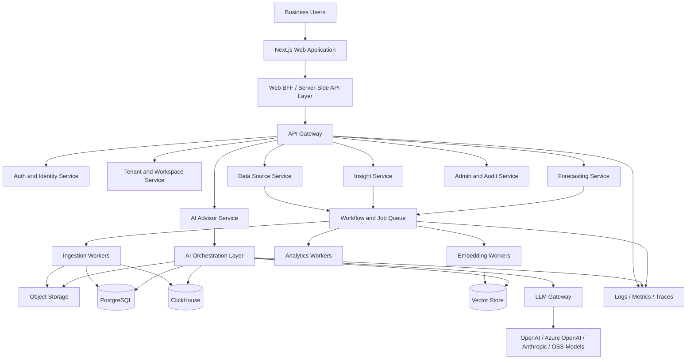

### 2.1 Component Communication

| Source | Target | Protocol | Purpose |
|---|---|---|---|
| Browser | Web app | HTTPS | User interaction and UI rendering |
| Web app | API gateway | HTTPS | Authenticated application APIs |
| API gateway | Microservices | HTTP/gRPC internal | Domain service operations |
| Services | PostgreSQL | SQL | Transactional system of record |
| Services | Redis | Redis protocol | Cache, sessions, rate limits |
| Services | Queue/Temporal | Worker protocol | Durable async workflows |
| Workers | Object storage | S3 API | Raw files, exports, artifacts |
| AI orchestrator | Vector store | SQL/API | Semantic retrieval |
| AI orchestrator | LLM gateway | HTTPS/internal API | Model calls, routing, metering |
| LLM gateway | Model providers | HTTPS | LLM and embedding requests |
| All services | Observability stack | OpenTelemetry | Logs, metrics, traces |

---

## 3. Microservice Architecture

The platform should begin as a modular monorepo with independently deployable services where operationally justified. Early development may run some services together, but boundaries should be clear from day one.

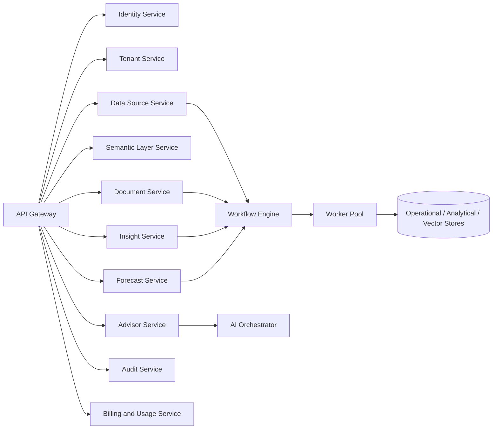

### 3.1 Services

| Service | Responsibility | Owns Data |
|---|---|---|
| Identity Service | User sessions, auth provider integration, invitations | User identity mapping, sessions |
| Tenant Service | Organizations, workspaces, tenant settings | Tenants, workspaces, memberships |
| Data Source Service | Connectors, uploads, sync jobs, schema discovery | Data source metadata |
| Semantic Layer Service | Metrics, dimensions, business entities, formulas | Metric definitions, semantic models |
| Document Service | File metadata, parsing lifecycle, document access | Documents, chunks, extraction status |
| Insight Service | Insight runs, anomalies, root causes, recommendation records | Insight entities and decisions |
| Advisor Service | Advisor sessions, messages, evidence presentation | Conversation metadata |
| Forecast Service | Forecast jobs, model metadata, forecast outputs | Forecast runs and results |
| AI Orchestrator | Agent workflows, RAG, tool calls, reasoning plans | Agent state, traces, memory references |
| LLM Gateway | Model routing, provider abstraction, costs, retries | Provider usage, model policies |
| Audit Service | Immutable audit events and security events | Audit logs |
| Billing and Usage Service | Plans, quotas, token/row/job usage | Metering and billing events |

### 3.2 Service Boundary Rules

- Each service owns its domain model and persistence interface.
- Cross-service access happens through explicit APIs or domain events.
- No service may bypass tenant context.
- AI services may not directly access raw data without scoped tools.
- Audit events are emitted by all services for sensitive actions.
- Shared libraries must contain contracts, telemetry, auth primitives, and utilities only.

---

## 4. AI Architecture

The AI layer is built as a governed multi-agent system. It does not replace deterministic analytics; it orchestrates tools, statistical analysis, semantic retrieval, and LLM reasoning to produce explainable business advice.

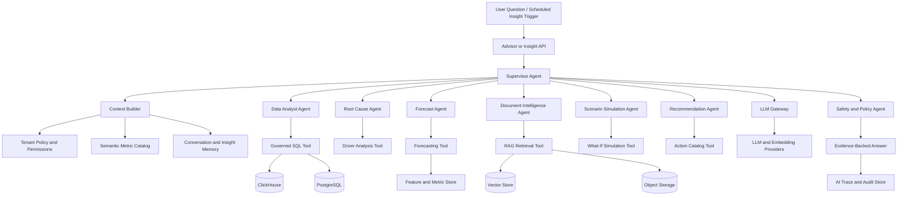

### 4.1 AI Design Principles

| Principle | Implementation |
|---|---|
| Evidence-first answers | Every insight must include metric sources, document citations, query references, or computation records. |
| Governed tool use | Agents use approved tenant-scoped tools instead of arbitrary database access. |
| Provider abstraction | Model calls go through the LLM gateway. |
| Human approval | Recommendations do not execute business actions automatically in version 1. |
| Confidence and caveats | Outputs include confidence, assumptions, and data-quality warnings. |
| Prompt-injection resistance | Retrieved documents are treated as untrusted content. |
| Evaluation loop | Prompts, agents, and model outputs are evaluated continuously. |

### 4.2 AI Runtime Flow

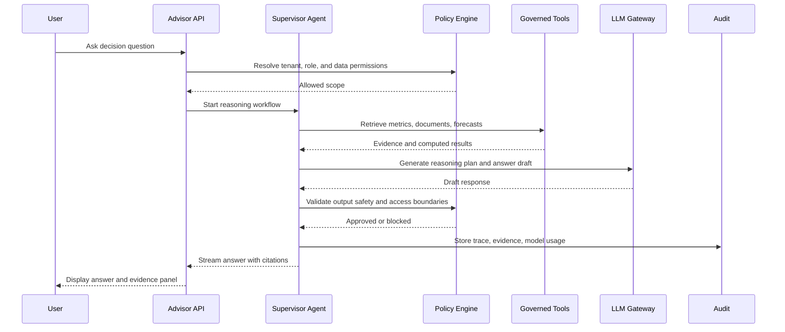

---

## 5. Data Flow Diagrams

### 5.1 Data Ingestion Flow

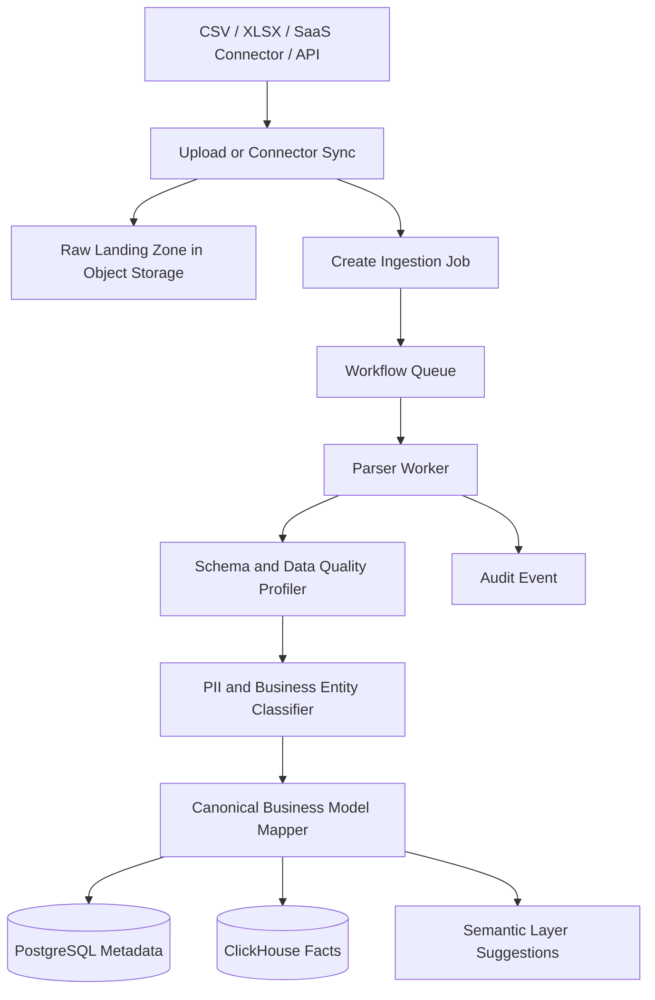

### 5.2 Document Intelligence Flow

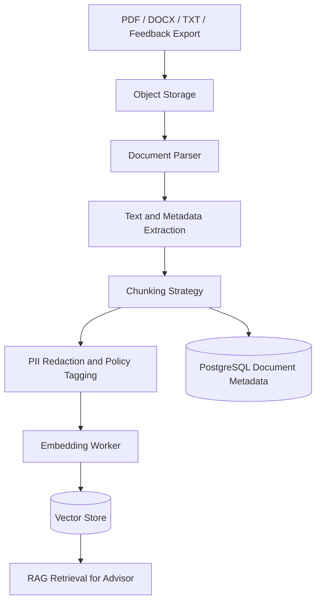

### 5.3 Insight Generation Flow

```mermaid
flowchart LR
    Schedule[Scheduled or Manual Trigger] --> InsightRun[Create Insight Run]
    InsightRun --> Metrics[Load Certified Metrics]
    Metrics --> Detect[Anomaly and Trend Detection]
    Detect --> Drivers[Root Cause Driver Analysis]
    Drivers --> Forecast[Forecast Impact]
    Forecast --> Recommend[Generate Recommendations]
    Recommend --> Evidence[Attach Evidence]
    Evidence --> Review[Policy and Quality Review]
    Review --> Publish[Publish Insight]
    Publish --> Notify[Notify Users]
```

### 5.4 User Decision Flow

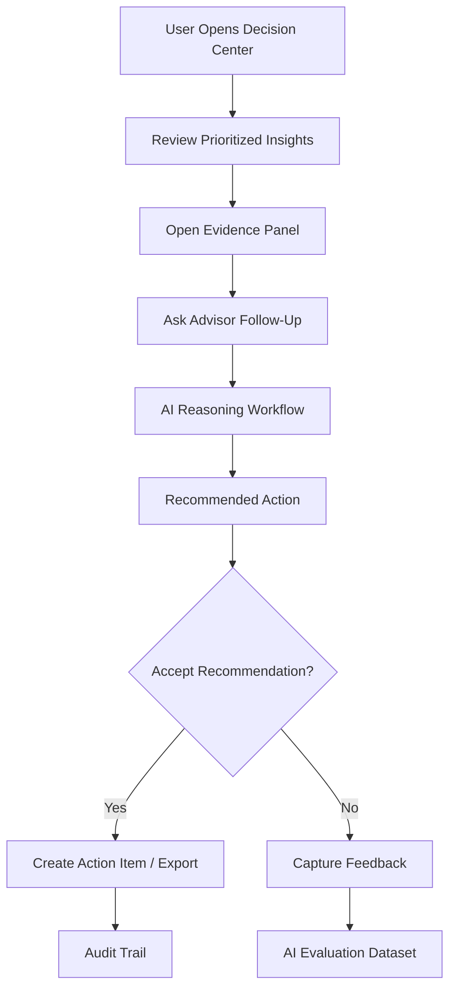

---

## 6. Component Diagrams

### 6.1 Frontend Component Diagram

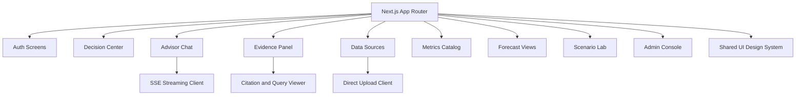

### 6.2 Backend Component Diagram

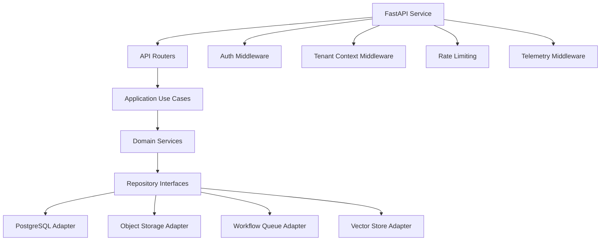

### 6.3 Data Platform Component Diagram

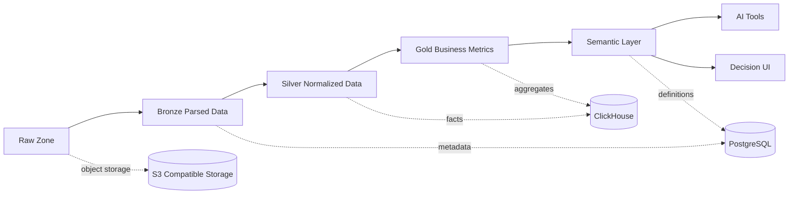

---

## 7. Deployment Architecture

The production deployment should be containerized and cloud-native. MVP may start on managed container services, but the architecture should remain Kubernetes-compatible.

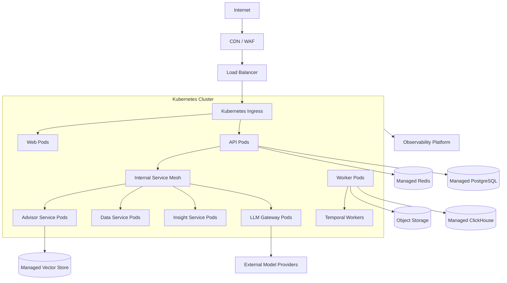

### 7.1 Deployment Units

| Unit | Scaling Metric |
|---|---|
| Web app | CPU, memory, request rate |
| API service | Request latency, CPU, DB pool saturation |
| Advisor service | Concurrent sessions, model latency |
| LLM gateway | Token throughput, provider latency |
| Ingestion workers | Queue depth, job duration |
| Embedding workers | Queue depth, embedding provider rate |
| Analytics workers | Job queue depth, CPU, memory |
| Forecast workers | Job duration, CPU/memory |

---

## 8. Authentication Flow

The platform should use OIDC/OAuth for MVP with SAML and SCIM support for enterprise.

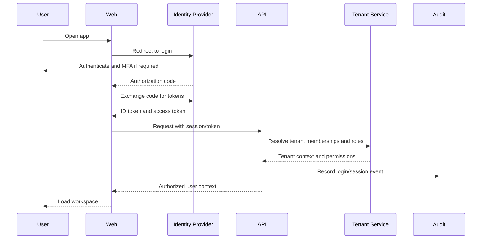

### 8.1 Authorization Model

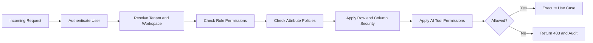

---

## 9. Security Architecture

Security is enforced across identity, application, data, AI, infrastructure, and operations.

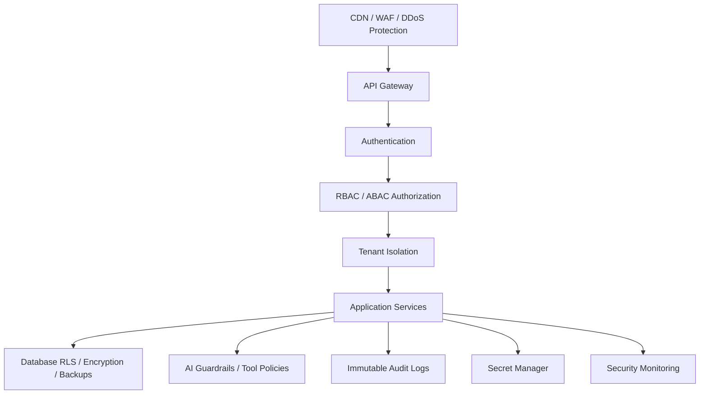

### 9.1 Security Controls

| Layer | Controls |
|---|---|
| Edge | WAF, DDoS protection, TLS, bot controls, IP allowlists for enterprise |
| Application | Secure cookies, CSRF protection, input validation, rate limits |
| API | Tenant context, RBAC, ABAC, idempotency, request signing for webhooks |
| Data | Encryption at rest, row-level security, backups, least-privilege credentials |
| AI | Prompt-injection defense, evidence requirements, model policy enforcement |
| Infrastructure | Private networking, secret manager, image scanning, runtime policies |
| Operations | Audit logs, alerting, incident response, access reviews |

### 9.2 Data Classification

| Classification | Examples | Handling |
|---|---|---|
| Public | Public company metadata | Standard controls |
| Internal | Workspace settings, non-sensitive metrics | Tenant access required |
| Confidential | Revenue, customers, forecasts | Encryption, RBAC, audit |
| Restricted | PII, contracts, payment data | Redaction, limited access, strict audit |

---

## 10. Cloud Architecture

The platform should be cloud-agnostic at the architecture level, with AWS as the reference cloud because of its mature managed data, security, and container services.

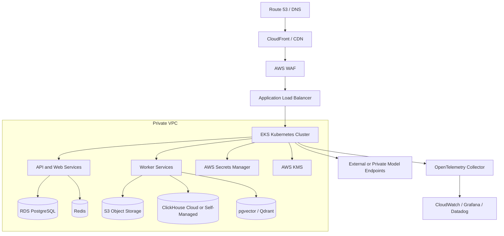

### 10.1 Cloud Services

| Capability | AWS Reference | Portable Alternative |
|---|---|---|
| DNS/CDN/WAF | Route 53, CloudFront, AWS WAF | Cloudflare |
| Containers | EKS | GKE, AKS, ECS |
| Relational DB | RDS PostgreSQL / Aurora PostgreSQL | Cloud SQL, Azure Database |
| Object storage | S3 | GCS, Azure Blob, R2, MinIO |
| Cache | ElastiCache Redis | Memorystore, Azure Cache |
| Secrets | AWS Secrets Manager | GCP Secret Manager, Azure Key Vault |
| KMS | AWS KMS | Cloud KMS, Azure Key Vault |
| Queue/workflows | Temporal Cloud or self-hosted | Cloud Tasks, SQS plus workers |
| Observability | CloudWatch plus OpenTelemetry | Datadog, Grafana Cloud |

---

## 11. Scalability Strategy

### 11.1 Scaling Dimensions

| Dimension | Strategy |
|---|---|
| Tenants | Tenant-aware data model, tenant quotas, optional tenant sharding |
| Users | Horizontally scale web/API pods; cache user and permission context |
| Records | Move analytical facts to ClickHouse; partition by tenant and time |
| Documents | Store raw files in object storage; index chunks in vector store |
| AI requests | Queue long tasks, stream responses, route by model complexity |
| Embeddings | Batch embedding jobs with provider rate-limit awareness |
| Forecasting | Async jobs, cached outputs, precomputed feature sets |
| Connectors | Isolated worker pools per connector class and tenant priority |

### 11.2 Growth Architecture

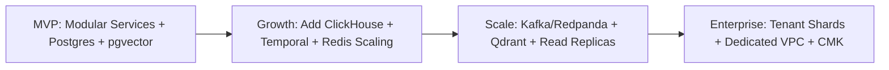

### 11.3 Multi-Tenant Scaling Controls

- Tenant quotas for storage, rows, documents, tokens, jobs, and users.
- Per-tenant rate limits at API gateway and LLM gateway.
- Queue priorities by tenant plan.
- Query timeouts and maximum scanned rows.
- Separate worker pools for ingestion, analytics, embeddings, and AI.
- Dedicated collections or databases for high-value enterprise tenants.
- Model routing policies by cost, latency, data sensitivity, and task type.

---

## 12. Disaster Recovery

### 12.1 Recovery Objectives

| System Area | RPO | RTO |
|---|---:|---:|
| PostgreSQL transactional data | 5 minutes | 1 hour |
| Object storage | Near zero with versioning | 1 hour |
| Audit logs | Near zero | 1 hour |
| ClickHouse analytics | 15 minutes | 4 hours |
| Vector indexes | 24 hours if rebuildable | 8 hours |
| Redis cache | Best effort | 30 minutes |
| AI workflow state | 5 minutes | 2 hours |

### 12.2 DR Architecture

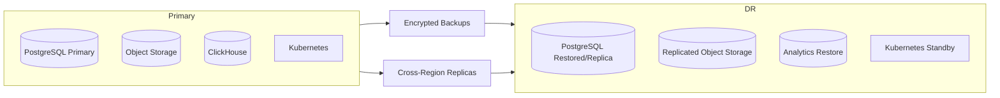

### 12.3 Disaster Recovery Practices

- Enable point-in-time recovery for PostgreSQL.
- Use versioned object storage with lifecycle policies.
- Replicate critical buckets across regions.
- Store infrastructure as code in version control.
- Keep container images in replicated registries.
- Test restore procedures quarterly.
- Run backup integrity checks automatically.
- Define incident severity levels and communication templates.
- Maintain a manual emergency access process with audit logging.

---

## 13. Technology Justification

| Area | Technology | Justification |
|---|---|---|
| Frontend | Next.js + TypeScript | Strong React ecosystem, server rendering, routing, API integration, enterprise maintainability. |
| UI system | Tailwind CSS + Radix/shadcn-style components | Fast accessible UI delivery with design-system consistency. |
| Backend | FastAPI + Python | Excellent for AI/ML workloads, async APIs, typed validation, OpenAPI generation. |
| Domain modeling | Pydantic + SQLAlchemy | Strong validation, clean data models, mature database access. |
| Primary database | PostgreSQL | Reliable transactional store, JSON support, indexing, partitioning, RLS, strong ecosystem. |
| Analytics database | ClickHouse | High-performance analytical queries over large event and metric datasets. |
| Vector search | pgvector initially, Qdrant at scale | pgvector simplifies MVP operations; Qdrant provides dedicated vector search scaling. |
| Cache | Redis | Low-latency caching, rate limits, distributed locks, ephemeral state. |
| Object storage | S3-compatible storage | Durable, scalable raw file and artifact storage. |
| Workflows | Temporal | Durable long-running workflows, retries, visibility, and replay for ingestion and AI jobs. |
| AI orchestration | LangGraph | Stateful multi-agent workflows, human-in-the-loop path, memory and persistence model. |
| Model access | LLM Gateway | Centralized model routing, cost control, retries, audit, and provider abstraction. |
| Containers | Docker | Consistent local development, CI, and production packaging. |
| Orchestration | Kubernetes | Standard horizontal scaling, service isolation, rolling deployments, workload portability. |
| Infrastructure | Terraform | Reproducible cloud infrastructure and environment parity. |
| CI/CD | GitHub Actions | Repository-native automation for testing, scanning, building, and deployment. |
| Observability | OpenTelemetry + Grafana/Datadog | Vendor-neutral instrumentation with strong production monitoring options. |
| Authentication | Managed OIDC/SAML provider | Reduces security burden and supports enterprise identity requirements. |
| Secrets | Cloud secret manager | Centralized secret storage, rotation, and auditability. |

### 13.1 Key Tradeoffs

| Decision | Benefit | Tradeoff |
|---|---|---|
| Modular monorepo first | Faster product iteration and shared contracts | Requires discipline to preserve service boundaries |
| PostgreSQL plus ClickHouse | Correct transactional data and fast analytics | Two database systems to operate |
| pgvector first | Faster MVP and simpler deployment | May need migration to Qdrant for large-scale vector workloads |
| Temporal for workflows | Durable, observable async processing | More operational complexity than a simple queue |
| Managed auth provider | Faster secure launch | Vendor dependency and recurring cost |
| Kubernetes-compatible deployment | Enterprise scalability and portability | Higher complexity than basic PaaS hosting |

---

## 14. Summary Architecture Decision

The recommended foundation is a cloud-native, multi-tenant, AI-first SaaS architecture:

- Next.js frontend for the decision workspace.
- FastAPI services for domain APIs.
- PostgreSQL as transactional source of truth.
- ClickHouse for analytical workloads.
- pgvector for MVP semantic retrieval, with Qdrant as the scale path.
- Object storage for files and artifacts.
- Temporal-backed workers for ingestion, insight generation, embeddings, and forecasting.
- LangGraph-based multi-agent AI orchestration.
- LLM gateway for model routing, governance, cost control, and provider abstraction.
- OpenTelemetry-based observability.
- Managed OIDC/SAML-ready authentication.
- Kubernetes-compatible deployment on a secure cloud foundation.

This architecture is intentionally pragmatic: it can ship an MVP without overbuilding, while giving the product a credible path to enterprise security, multi-region resilience, and large-scale AI decision intelligence.
