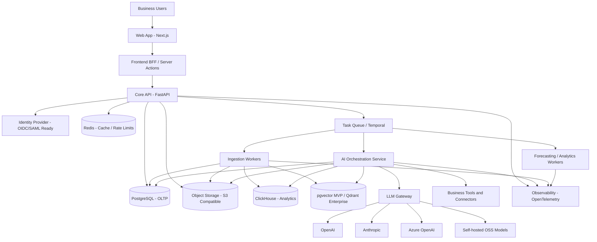
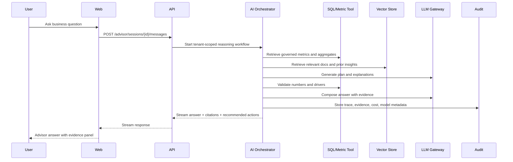
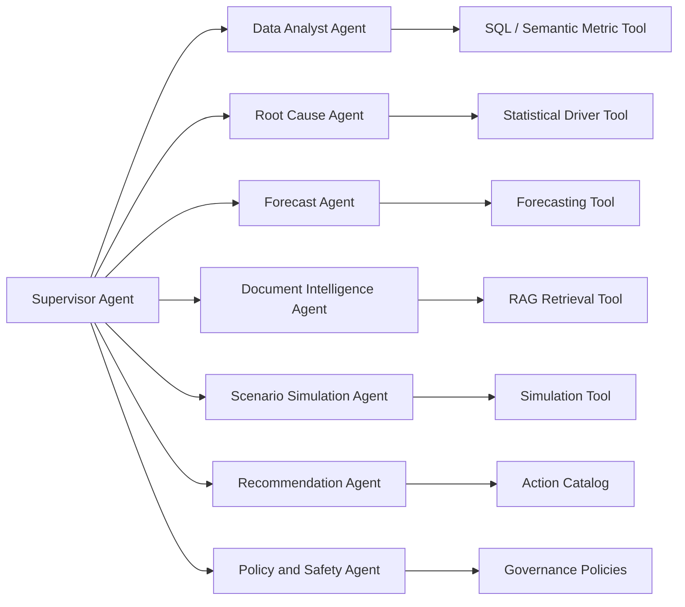
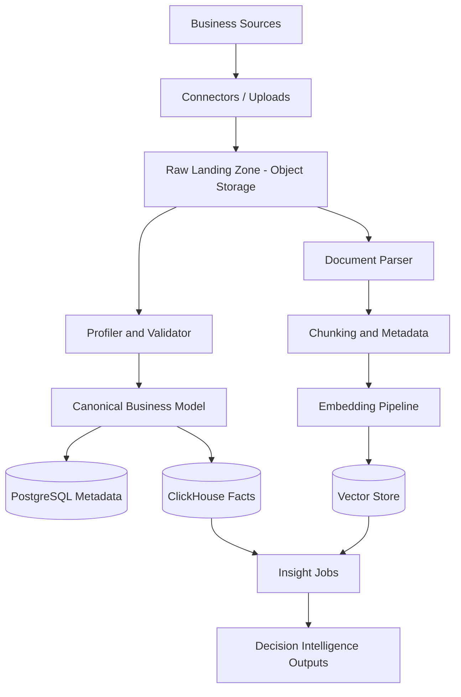

# Software Architecture Document

## AI Business Decision Intelligence Platform

Document status: Initial foundation  
Prepared on: 2026-07-06  
Version: 0.1  
Scope: Product definition, architecture, technology decisions, folder structure, standards, scalability, and security. No application code is included.

---

## 1. Executive Summary

The AI Business Decision Intelligence Platform is an AI-first SaaS product that helps small and medium businesses move beyond dashboards into autonomous business reasoning. The platform ingests structured and unstructured business data, detects anomalies, explains root causes, forecasts trends, simulates business scenarios, and recommends explainable actions.

The first version should not attempt to become a full enterprise BI suite. It should prove a focused wedge: connect business data, generate trusted AI insights, explain evidence, and guide decisions with measurable impact. The architecture below is designed so the MVP can ship quickly while preserving a path to multi-tenant enterprise scale.

---

## 2. Product Definition

### 2.1 Purpose

Help business leaders answer:

- What changed in my business?
- Why did it change?
- What is likely to happen next?
- What should I do about it?
- What evidence supports the recommendation?

### 2.2 Vision

Become an AI Business Advisor for SMEs and growing enterprises: a system that reasons across company data, documents, customer signals, market context, and operational constraints to produce trusted, explainable business decisions.

### 2.3 Mission

Make advanced decision intelligence affordable, trustworthy, and usable by non-technical business teams without requiring a full data science department.

### 2.4 Target Users

| User Segment | Primary Needs | Example Jobs |
|---|---|---|
| Founders and owners | Fast answers, strategy, growth levers | "Why did revenue dip this month?" |
| Sales leaders | Pipeline health, customer trends, forecasting | "Which deals are at risk?" |
| Operations managers | Bottlenecks, cost leakage, resource planning | "Where are delays increasing?" |
| Finance teams | Forecasting, scenario planning, variance analysis | "What happens if costs rise 8%?" |
| Marketing teams | Campaign performance, customer sentiment | "Which channels drive profitable customers?" |
| Customer success teams | Churn signals, feedback themes | "Which customers need intervention?" |
| Analysts | Data validation, insight review, exports | "Show evidence and lineage." |

### 2.5 Business Objectives

| Objective | Rationale |
|---|---|
| Reduce time from data to decision | Core differentiation over dashboards. |
| Increase adoption among non-technical users | Product must feel like an advisor, not a query tool. |
| Build trust through evidence and explainability | AI recommendations must be auditable. |
| Support low-friction onboarding | SMEs need connectors, templates, and guided setup. |
| Create expansion paths | Add seats, data volume, connectors, advanced models, enterprise governance. |

### 2.6 Success Metrics

| Category | Metric | Target Direction |
|---|---|---|
| Activation | Time to first useful insight | Down |
| Engagement | Weekly active decision sessions | Up |
| Trust | Percentage of insights with viewed evidence | Up |
| Accuracy | Forecast error by business metric | Down |
| Impact | User-confirmed actions taken from recommendations | Up |
| Retention | 90-day logo and seat retention | Up |
| Efficiency | Cost per AI insight | Down |
| Reliability | Insight generation success rate | Up |

### 2.7 Core Value Proposition

Traditional BI tells users what happened. This platform explains why it happened, predicts what may happen next, simulates strategic options, and recommends actions with evidence, confidence, and business context.

---

## 3. Functional Scope

### 3.1 MVP Features

| Area | MVP Capability | Notes |
|---|---|---|
| Workspace and tenant setup | Organization, workspace, roles | Multi-tenant from day one. |
| Authentication | Email/password or SSO-ready OAuth/OIDC | Managed identity preferred. |
| Data ingestion | CSV/XLSX upload, Google Sheets, manual connector framework | Start simple; design connector abstraction. |
| Data profiling | Schema detection, column classification, quality checks | Required before AI reasoning. |
| Business semantic layer | Metrics, dimensions, business entities | Prevents raw-table AI chaos. |
| Insight discovery | Automated anomalies, trends, top movers | Scheduled and on demand. |
| Root cause analysis | Driver analysis across dimensions | Explain changes with ranked contributors. |
| Forecasting | Time-series forecasts for core metrics | Start with interpretable baselines plus ML. |
| AI business advisor chat | Natural-language business Q&A over governed data | RAG plus SQL/tool calling. |
| Evidence panel | Source rows, documents, generated SQL, confidence | Trust surface. |
| Recommendation engine | Suggested actions with expected impact and risk | Human approval in MVP. |
| Document ingestion | PDF/DOCX/TXT upload for policy, reports, feedback | Chunking and embeddings. |
| Audit trail | User actions, model calls, insight generation logs | Required for trust and debugging. |
| Admin basics | Users, roles, data sources, billing readiness | Billing may be stubbed until paid launch. |

### 3.2 Enterprise Features

| Area | Enterprise Capability |
|---|---|
| Identity | SAML/OIDC SSO, SCIM provisioning, MFA enforcement |
| Governance | Fine-grained RBAC/ABAC, row-level access, approval workflows |
| Data | Warehouse connectors, reverse ETL, dbt integration, data lineage |
| AI | Bring-your-own-model, private model gateway, custom agent policies |
| Compliance | Retention policies, legal hold, regional data residency |
| Reliability | Dedicated tenant isolation options, SLA tiers |
| Observability | Tenant-level usage, cost, latency, quality dashboards |
| Security | Customer-managed keys, private networking, IP allowlists |
| Collaboration | Decision rooms, comments, assignments, Jira/Slack/Teams sync |

### 3.3 Future Roadmap

| Horizon | Themes | Deliverables |
|---|---|---|
| 0-3 months | MVP decision intelligence | Data upload, semantic metrics, insights, advisor chat, evidence |
| 3-6 months | Connectors and forecasting depth | Accounting, CRM, ecommerce, support, advanced time-series models |
| 6-12 months | Scenario simulation | What-if modeling, action planning, optimization constraints |
| 12-18 months | Enterprise governance | SSO, SCIM, regional deployment, advanced audit, RBAC/ABAC |
| 18+ months | Autonomous decision operations | Multi-agent workflows, action execution, continuous business monitoring |

### 3.4 Explicitly Out of Scope for Version 1

- Fully autonomous execution of business actions without human approval.
- Building a general-purpose spreadsheet replacement.
- Pixel-perfect custom dashboard builder.
- Real-time streaming analytics for every tenant.
- On-premise deployment.
- Custom model fine-tuning UI.
- Full data warehouse replacement.
- Mobile native apps.
- Complex ML experimentation platform.
- Blockchain, tokenization, or unrelated financial trading features.

---

## 4. Architecture Principles

| Principle | Decision Impact |
|---|---|
| Clean architecture | Domain logic must not depend on frameworks, databases, or vendors. |
| Multi-tenant by design | Every domain entity must include tenant/workspace boundaries. |
| Evidence-first AI | AI outputs must carry source references, confidence, and traceability. |
| Human approval for actions | Recommendations are advisory until explicit approval is built. |
| Model-provider abstraction | The platform must support multiple LLM and embedding providers. |
| Async by default for heavy work | Ingestion, profiling, embeddings, forecasting, and agents run in workers. |
| Observability from day one | Logs, metrics, traces, model costs, and prompt traces are first-class. |
| Security as product surface | Audit, permissions, privacy, and explainability are user-visible trust features. |

---

## 5. High-Level System Architecture



### 5.1 Component Responsibilities

| Component | Responsibility | Communication |
|---|---|---|
| Web App | Product UI, advisor chat, insight workspace, admin screens | HTTPS to BFF/API |
| BFF Layer | Session-aware UI data loading, aggregation, streaming responses | Internal HTTPS to Core API |
| Core API | Tenant-aware business APIs, auth checks, orchestration commands | REST initially; internal events/jobs |
| AI Orchestration Service | Multi-agent workflows, RAG, tool use, recommendation generation | Task queue, model gateway, databases |
| LLM Gateway | Provider abstraction, routing, retries, cost controls, safety filters | HTTPS to model providers |
| Ingestion Workers | File parsing, connector sync, schema profiling, normalization | Queue-triggered jobs |
| Analytics Workers | Aggregations, anomaly detection, forecasting, scenario computation | Queue-triggered jobs |
| PostgreSQL | Transactional source of truth | SQL |
| ClickHouse | High-volume analytics and time-series aggregates | SQL |
| Vector Store | Semantic search over documents, metric definitions, insight memory | Vector APIs / SQL |
| Object Storage | Raw files, parsed documents, exports, artifacts | S3 API |
| Redis | Cache, distributed locks, rate limiting, short-lived state | Redis protocol |
| Temporal / Queue | Durable background workflows | Worker polling |
| Identity Provider | Authentication, OIDC, SSO, MFA | OIDC/SAML |
| Observability Stack | Logs, metrics, traces, AI evaluation, cost visibility | OpenTelemetry |

### 5.2 Communication Model

| Flow | Pattern | Why |
|---|---|---|
| Browser to app/API | HTTPS + secure cookies | Standard SaaS security boundary. |
| User asks advisor | Streaming API response | Supports token streaming and progress updates. |
| File upload | Pre-signed object storage upload + API registration | Avoids routing large files through app servers. |
| Data ingestion | Async workflow | Parsing, validation, and embeddings are slow and retryable. |
| Insight generation | Async jobs with notifications | Allows scheduled and on-demand intelligence. |
| AI tool calls | Internal service calls with tenant-scoped credentials | Prevents model/provider from directly accessing raw systems. |
| Realtime UI updates | Server-sent events initially; WebSocket later | Simpler MVP path, upgradeable for collaboration. |
| Service telemetry | OpenTelemetry traces/metrics/logs | Vendor-neutral observability. |

### 5.3 AI Decision Intelligence Flow



---

## 6. Multi-Agent Layer

### 6.1 Agent Design

The platform should use a supervised multi-agent architecture. A coordinator decides which specialist agents are needed, invokes tools, checks evidence, and composes the final recommendation.



### 6.2 Agent Responsibilities

| Agent | Responsibility | Guardrails |
|---|---|---|
| Supervisor Agent | Plans workflow, routes tasks, merges results | Must use approved tools only. |
| Data Analyst Agent | Converts questions into metric queries | Must use semantic layer; no raw SQL from user input. |
| Root Cause Agent | Finds drivers, segments, anomalies | Must return statistical basis and caveats. |
| Forecast Agent | Produces forecasts and confidence ranges | Must show model type, horizon, error where available. |
| Document Intelligence Agent | Extracts themes from unstructured sources | Must cite documents/chunks. |
| Scenario Agent | Runs what-if calculations | Must separate assumptions from observed facts. |
| Recommendation Agent | Ranks actions by impact, effort, risk | Must include evidence and confidence. |
| Policy and Safety Agent | Checks privacy, permissions, prompt injection, output policy | Must block unsafe data exposure. |

### 6.3 AI Memory

| Memory Type | Storage | Examples |
|---|---|---|
| Short-term session memory | Agent state store / Redis / database | Current advisor conversation |
| Long-term tenant memory | PostgreSQL + vector store | Prior insights, business definitions |
| Document memory | Object storage + vector store | Uploaded reports, feedback, contracts |
| Evaluation memory | Observability/evaluation store | Prompt traces, answer scores, incidents |

---

## 7. Data Architecture

### 7.1 Data Stores

| Store | Recommended Technology | Use |
|---|---|---|
| OLTP database | PostgreSQL | Tenants, users, metrics, metadata, jobs, audit logs |
| Vector database | pgvector for MVP; Qdrant for enterprise scale | Semantic retrieval over documents and insight memory |
| OLAP database | ClickHouse | High-volume event, metric, and analytical queries |
| Cache | Redis | Session cache, rate limits, distributed locks |
| Object storage | S3-compatible storage | Raw uploads, parsed artifacts, exports |
| Search | OpenSearch later if needed | Full-text search across documents and insights |

### 7.2 Data Flow



### 7.3 Canonical Business Domains

| Domain | Example Entities |
|---|---|
| Sales | Lead, opportunity, deal, pipeline stage, revenue |
| Customer | Account, contact, segment, lifecycle stage |
| Marketing | Campaign, channel, spend, conversion |
| Finance | Invoice, expense, margin, cash flow |
| Operations | Order, fulfillment, SLA, capacity |
| Support | Ticket, sentiment, reason code, resolution |
| Documents | Report, policy, customer feedback, meeting note |

### 7.4 Semantic Layer

The semantic layer is the contract between raw data and AI. It defines:

- Business metrics, dimensions, and filters.
- Metric formulas and ownership.
- Valid time grains and comparison periods.
- Row-level and column-level permissions.
- Synonyms and business terminology.
- Certified versus experimental metrics.

AI agents must query the semantic layer instead of inventing formulas directly from raw tables.

---

## 8. Technology Stack

### 8.1 Recommended Stack

| Layer | Recommendation | Why |
|---|---|---|
| Frontend | Next.js with TypeScript | Full-stack React framework, App Router, server components, strong ecosystem. |
| UI | Tailwind CSS + shadcn/ui + Radix primitives | Fast enterprise UI delivery, accessible primitives, customizable design system. |
| Charts | Apache ECharts or Observable Plot | Strong analytical visualizations without locking into a BI vendor. |
| Backend API | FastAPI with Python | Async APIs, OpenAPI generation, Python-native AI/ML ecosystem. |
| Domain validation | Pydantic | Typed request/response models and domain DTO validation. |
| ORM/data access | SQLAlchemy 2.x + Alembic | Mature SQL modeling and migrations. |
| Async workflows | Temporal | Durable ingestion, AI, forecasting, and retryable workflows. |
| Queue/cache | Redis | Caching, rate limits, lightweight pub/sub, distributed locks. |
| OLTP | PostgreSQL | Reliable, extensible transactional database with JSON, RLS, partitioning. |
| Vector MVP | pgvector | Keeps embeddings near tenant metadata and simplifies early operations. |
| Vector scale option | Qdrant | Dedicated vector search when retrieval volume or isolation requirements grow. |
| OLAP | ClickHouse | Fast analytical queries over high-volume events and facts. |
| Object storage | AWS S3 / Cloudflare R2 / MinIO | Standard durable file and artifact storage. |
| AI orchestration | LangGraph | Stateful, long-running, observable agent workflows. |
| LLM integration | Provider-neutral LLM gateway | Allows OpenAI, Anthropic, Azure OpenAI, Gemini, and OSS routing. |
| Embeddings | Provider abstraction | Enables cost/quality tuning and regional constraints. |
| ML libraries | scikit-learn, statsmodels, Prophet or NeuralForecast as needed | Interpretable baselines first, advanced models later. |
| Auth | Auth0, WorkOS, or Clerk for MVP; OIDC/SAML abstraction | Reduces security burden and enables enterprise SSO path. |
| API gateway | Cloudflare, Kong, or managed cloud gateway | Rate limiting, WAF, routing, edge protection. |
| Containers | Docker | Portable local, CI, and production packaging. |
| Orchestration | Kubernetes for scale; managed PaaS for early MVP acceptable | Standard enterprise deployment model. |
| IaC | Terraform | Repeatable cloud infrastructure. |
| CI/CD | GitHub Actions | Repository-native CI/CD and security automation. |
| Observability | OpenTelemetry + Prometheus/Grafana + Loki/Tempo or Datadog | Vendor-neutral instrumentation with managed option. |
| Product analytics | PostHog or Segment | Activation, retention, and usage events. |
| Secrets | Cloud secret manager + sealed secrets for Kubernetes | Avoids secrets in code or CI logs. |

### 8.2 Architecture Decision Records

| Decision | Choice | Alternatives Considered | Reason |
|---|---|---|---|
| Repository model | Modular monorepo | Many repos | Faster coordinated early development while preserving service boundaries. |
| Frontend framework | Next.js | Vite SPA, Remix | Server rendering, routing, BFF patterns, mature React ecosystem. |
| Backend language | Python | Node/NestJS, Go | AI/ML ecosystem and FastAPI productivity outweigh polyglot simplicity. |
| API style | REST + OpenAPI first | GraphQL first, gRPC first | Easier external integrations and enterprise documentation. |
| Background workflows | Temporal | Celery only, BullMQ only | Durable long-running jobs, retries, visibility, replay. |
| Primary DB | PostgreSQL | MySQL, DynamoDB | Relational integrity, RLS, JSON support, extensibility, strong operations. |
| Vector DB path | pgvector first, Qdrant later | Pinecone-only, Weaviate-only | Lower MVP complexity with clear scale escape hatch. |
| Analytics DB | ClickHouse | BigQuery-only, Snowflake-only, Postgres-only | Fast SaaS analytics at controllable cost; warehouse connectors can still exist. |
| AI orchestration | LangGraph | Hand-rolled state machines, simple chains | Stateful agent workflows, persistence, human-in-loop path. |
| Model integration | LLM gateway | Direct provider calls everywhere | Cost control, routing, fallback, audit, security policies. |
| Auth strategy | Managed OIDC/SAML-ready provider | Build auth in-house | Security and compliance risk reduction. |
| Deployment | Containerized services | Serverless-only | Long-running AI/ingestion workloads need durable worker model. |
| Observability | OpenTelemetry standard | Vendor SDK only | Avoids telemetry lock-in. |

---

## 9. API Architecture

### 9.1 API Standards

| Standard | Rule |
|---|---|
| Versioning | Prefix external APIs with `/api/v1`. |
| Resource naming | Use plural nouns: `/tenants`, `/workspaces`, `/insights`. |
| IDs | Use UUID/ULID identifiers, never sequential public IDs. |
| Pagination | Cursor pagination for lists that may grow. |
| Filtering | Explicit query parameters, validated allowlists. |
| Sorting | Allowlisted fields only. |
| Idempotency | Required for uploads, connector syncs, billing, and action execution. |
| Errors | Problem Details style shape with stable machine-readable codes. |
| Auth | Bearer tokens or secure cookies; all requests tenant-scoped. |
| Streaming | Use SSE for advisor responses in MVP. |

### 9.2 Primary API Domains

| Domain | Example Resources |
|---|---|
| Identity and access | users, roles, permissions, invitations |
| Tenancy | tenants, workspaces, plans, limits |
| Data sources | connectors, uploads, sync jobs, schemas |
| Semantic layer | metrics, dimensions, entities, formulas |
| Insights | insight runs, anomalies, root causes, recommendations |
| Advisor | sessions, messages, tool calls, evidence |
| Documents | files, chunks, embeddings, extraction jobs |
| Forecasts | models, forecast runs, scenarios |
| Audit | events, traces, access logs |
| Admin | feature flags, usage, billing events |

### 9.3 Error Model

All APIs should return a consistent error envelope:

| Field | Purpose |
|---|---|
| `code` | Stable machine-readable error code |
| `message` | Safe user-facing summary |
| `details` | Optional validation or domain details |
| `request_id` | Correlation ID for support |
| `retryable` | Whether client retry is appropriate |

---

## 10. Enterprise Folder Structure

The initial repository should be a modular monorepo. The structure below is a foundation target, not a request to generate application code yet.

```text
ai-business-decision-intelligence-platform/
  README.md
  docs/
    software-architecture-document.md
    adr/
    product/
    api/
    security/
    operations/
  apps/
    web/
      app/
      components/
      features/
      lib/
      styles/
      tests/
  services/
    api/
      src/
        application/
        domain/
        infrastructure/
        interfaces/
        shared/
      migrations/
      tests/
    ai-orchestrator/
      src/
        agents/
        graphs/
        tools/
        memory/
        evaluators/
        providers/
        policies/
      tests/
    ingestion-worker/
      src/
        connectors/
        parsers/
        profilers/
        normalizers/
        jobs/
      tests/
    analytics-worker/
      src/
        anomaly_detection/
        forecasting/
        root_cause/
        simulation/
        jobs/
      tests/
    llm-gateway/
      src/
        providers/
        routing/
        safety/
        metering/
        prompts/
      tests/
  packages/
    contracts/
      openapi/
      schemas/
    config/
    telemetry/
    security/
    ui/
  infrastructure/
    docker/
    terraform/
      environments/
        dev/
        staging/
        production/
    kubernetes/
      base/
      overlays/
    helm/
  scripts/
    dev/
    ci/
    data/
  tests/
    e2e/
    load/
    security/
  .github/
    workflows/
```

### 10.1 Clean Architecture Boundaries

| Layer | Contains | Must Not Depend On |
|---|---|---|
| Domain | Entities, value objects, domain services, policies | Web frameworks, databases, vendors |
| Application | Use cases, commands, queries, orchestration | HTTP-specific details |
| Infrastructure | Repositories, external APIs, storage, queues | UI |
| Interfaces | API controllers, request/response mapping | Direct database implementation details |
| Shared | Cross-cutting primitives only | Business feature internals |

---

## 11. Coding Standards

### 11.1 Naming Conventions

| Item | Convention | Example |
|---|---|---|
| Python modules | `snake_case` | `forecast_service.py` |
| Python classes | `PascalCase` | `InsightRunService` |
| Python functions | `snake_case` | `generate_forecast` |
| TypeScript files | `kebab-case` or framework convention | `insight-card.tsx` |
| React components | `PascalCase` | `EvidencePanel` |
| API routes | plural kebab-case | `/api/v1/insight-runs` |
| Database tables | `snake_case` plural | `insight_runs` |
| Environment variables | `UPPER_SNAKE_CASE` | `DATABASE_URL` |
| Event names | past-tense domain events | `insight.generated` |

### 11.2 Folder Conventions

- Feature code should live close to its owning domain.
- Shared packages must be intentionally small and stable.
- Tests should mirror source structure.
- Infrastructure code should be separated by environment.
- Generated artifacts must be clearly marked and excluded from manual editing.

### 11.3 API Standards

- Validate every request at the boundary.
- Never expose internal stack traces.
- Include `request_id` and `tenant_id` in logs and traces.
- Use OpenAPI as the external contract.
- Use idempotency keys for mutating operations that may be retried.
- Keep public API contracts backward compatible inside a major version.

### 11.4 Error Handling

| Error Type | Handling |
|---|---|
| Validation errors | Return 400 with field-level details. |
| Authentication errors | Return 401 without leaking account existence. |
| Authorization errors | Return 403 with generic message. |
| Not found | Return 404, tenant-scoped. |
| Conflict | Return 409 for duplicate or invalid state transitions. |
| Rate limit | Return 429 with retry metadata. |
| External provider failure | Retry with backoff, fallback provider if safe, return degraded response if possible. |
| AI uncertainty | Return qualified answer with confidence and caveats, not a fake certainty. |

### 11.5 Logging Strategy

- Use structured JSON logs.
- Include `timestamp`, `level`, `service`, `environment`, `request_id`, `tenant_id`, `user_id`, `job_id`, and `trace_id`.
- Redact PII, secrets, tokens, prompts containing sensitive data, and raw document text unless explicitly stored in secure audit storage.
- Separate application logs, audit logs, model traces, and security logs.
- Define log retention by tenant plan and compliance requirement.

### 11.6 Documentation Standards

- Architecture decisions belong in `docs/adr/`.
- Public API docs are generated from OpenAPI and reviewed before release.
- Every connector must document scopes, permissions, sync behavior, and failure modes.
- Every AI agent must document tools, prompts, safety constraints, evaluation criteria, and expected outputs.
- Every metric must have an owner, formula, grain, dimensions, and freshness SLA.

---

## 12. Scalability Design

### 12.1 Multi-Tenancy

| Layer | Strategy |
|---|---|
| Application | Every request resolved to tenant/workspace context before domain execution. |
| Database | Tenant ID on all tenant-owned tables; PostgreSQL RLS for sensitive data. |
| Object storage | Tenant-prefixed object keys and per-tenant access policies. |
| Vector store | Tenant/workspace metadata filters; optional per-tenant collections for enterprise. |
| Cache | Tenant-scoped keys and TTL policies. |
| Jobs | Tenant-aware queues, priorities, and quotas. |
| AI | Tenant-level model policies, rate limits, and data residency rules. |

### 12.2 Scaling Path

| Stage | Expected Scale | Architecture |
|---|---|---|
| MVP | Dozens of tenants, thousands to millions of rows | Managed Postgres, pgvector, object storage, Redis, worker pool |
| Growth | Hundreds of tenants, tens of millions of rows | Add ClickHouse, Temporal, read replicas, partitioning |
| Enterprise | Thousands of tenants, billions of analytical events | Dedicated OLAP clusters, Qdrant, Kafka/Redpanda, tenant sharding |
| Large enterprise | Regulated or high-volume tenants | Dedicated VPC, isolated databases, CMK, private model endpoints |

### 12.3 Real-Time Analytics

Version 1 should not promise universal real-time analytics. The architecture should support:

- Batch ingestion for files and SaaS connectors.
- Scheduled insight jobs.
- Near-real-time events for selected connectors later.
- Event streaming with Kafka/Redpanda when volume requires it.
- Materialized aggregates in ClickHouse for high-read workloads.

### 12.4 Performance Controls

- Tenant quotas for rows, files, tokens, forecast jobs, and scheduled insights.
- Query budgets and timeouts for AI-generated analytical queries.
- Precomputed metrics for common dashboard/advisor views.
- Caching for semantic layer definitions and frequently used aggregates.
- Circuit breakers for model providers and external connectors.
- Cost-aware LLM routing by task complexity.

---

## 13. Security Architecture

### 13.1 Authentication

- Use managed identity with OIDC/OAuth for MVP.
- Support SAML/OIDC SSO for enterprise.
- Enforce MFA for admin roles.
- Use secure, HttpOnly, SameSite cookies for browser sessions.
- Rotate refresh tokens and revoke sessions on security events.

### 13.2 Authorization

| Access Model | Use |
|---|---|
| RBAC | Workspace roles: owner, admin, analyst, viewer |
| ABAC | Data access by region, department, source, sensitivity |
| Row-level security | Tenant isolation and sensitive record protection |
| Tool permissions | AI agents can only use tools allowed by user role and tenant policy |

### 13.3 Encryption

| Data State | Requirement |
|---|---|
| In transit | TLS 1.2+ everywhere; TLS 1.3 preferred. |
| At rest | Managed database and object storage encryption. |
| Secrets | Cloud secrets manager; no secrets in repo or logs. |
| Enterprise | Customer-managed keys where required. |
| Backups | Encrypted backups with restore testing. |

### 13.4 Secure APIs

- Rate limit by tenant, user, route, and model budget.
- Use WAF and bot protection at the edge.
- Validate file type, size, and content before processing.
- Scan uploaded files for malware where available.
- Use pre-signed upload URLs with short expiry.
- Require idempotency keys for high-risk mutations.
- Apply least-privilege service credentials.

### 13.5 AI Security

| Risk | Control |
|---|---|
| Prompt injection in documents | Treat retrieved text as untrusted; use instruction hierarchy and policy checks. |
| Data leakage across tenants | Mandatory tenant filters in every retrieval/query tool. |
| Hallucinated metrics | Agents must use semantic metrics and cite evidence. |
| Unsafe recommendations | Human approval and policy checks before action execution. |
| Excessive model spend | Budgets, model routing, caching, and rate limits. |
| Sensitive data in prompts | Redaction, minimization, and provider policy controls. |

### 13.6 Audit Logs

Audit events must be immutable from the application perspective and include:

- Login, logout, failed auth, MFA changes.
- User invitation and role changes.
- Data source connection, sync, and deletion.
- File uploads and document access.
- AI question, model/provider metadata, tool calls, and evidence references.
- Insight generation and recommendation acceptance/rejection.
- Admin changes, billing changes, export events.

### 13.7 Data Privacy

- Classify data sensitivity during ingestion.
- Allow tenant-level data retention policies.
- Support right-to-delete workflows.
- Avoid training shared models on customer data unless explicitly contracted.
- Provide data export and deletion operations.
- Maintain subprocessors and provider policy documentation for enterprise customers.

---

## 14. DevOps and Deployment

### 14.1 Environments

| Environment | Purpose |
|---|---|
| Local | Developer workflows using containers and seed data |
| Dev | Shared integration testing |
| Staging | Production-like release validation |
| Production | Customer workloads |

### 14.2 CI/CD Pipeline

```mermaid
flowchart LR
    PR[Pull Request] --> LINT[Lint and Format]
    LINT --> TEST[Unit and Integration Tests]
    TEST --> SEC[Security Scans]
    SEC --> BUILD[Build Containers]
    BUILD --> PREVIEW[Preview Environment]
    PREVIEW --> APPROVE[Release Approval]
    APPROVE --> DEPLOY[Deploy]
    DEPLOY --> SMOKE[Smoke Tests]
    SMOKE --> OBS[Monitor Release]
```



### 14.3 Release Strategy

- Trunk-based development with short-lived feature branches.
- Feature flags for incomplete or risky features.
- Blue/green or rolling deployments.
- Database migrations with backward-compatible expand/contract pattern.
- Canary rollout for AI prompt, model, and agent changes.
- Automated rollback for health-check failures.

### 14.4 Monitoring and SLOs

| Area | Signals |
|---|---|
| API | Latency, error rate, throughput, saturation |
| Workers | Queue depth, job duration, retries, dead letters |
| AI | Token usage, cost, model latency, tool failures, answer quality |
| Data | Sync freshness, failed rows, schema drift |
| Security | Failed logins, permission denials, suspicious exports |
| Product | Activation, insight views, recommendation acceptance |

Initial SLOs:

- API availability: 99.5% for MVP, 99.9% for paid business tier.
- Advisor successful response rate: 98% excluding provider outages.
- Ingestion completion: 95% of standard files under 10 minutes.
- Critical audit log write success: 99.99%.

---

## 15. UX and Product Experience Foundation

### 15.1 Core Screens

| Screen | Purpose |
|---|---|
| Home / Decision Center | Prioritized insights, risks, recommendations |
| Advisor Chat | Natural-language decision workspace |
| Evidence Panel | Sources, metrics, SQL, documents, confidence |
| Data Sources | Uploads, connectors, sync status, quality |
| Metrics Catalog | Business metric definitions and ownership |
| Forecasts | Trend projections and confidence bands |
| Scenario Lab | What-if assumptions and projected outcomes |
| Recommendations | Suggested actions, impact, effort, owner, status |
| Admin | Users, roles, billing readiness, audit |

### 15.2 UX Principles

- Lead with decisions, not charts.
- Every AI answer should show evidence without forcing users to hunt.
- Use confidence and caveats plainly.
- Make data quality visible before AI conclusions.
- Use progressive disclosure: summary first, evidence next, technical lineage last.
- Keep analytical workflows fast for repeated daily use.

---

## 16. Risks and Mitigations

| Risk | Impact | Mitigation |
|---|---|---|
| AI hallucination | Loss of trust | Evidence-first answers, semantic layer, evals, guardrails |
| Poor data quality | Wrong decisions | Profiling, quality scores, user warnings |
| Connector complexity | Slow delivery | Start with uploads and a connector SDK |
| Model cost growth | Margin pressure | Caching, routing, quotas, cheaper models for simple tasks |
| Tenant data leakage | Severe security incident | Tenant-scoped access, RLS, retrieval filters, tests |
| Forecast overpromise | Bad recommendations | Baselines, confidence intervals, explain assumptions |
| Scope creep into dashboard builder | Delayed MVP | Keep v1 focused on advisor workflows |

---

## 17. Initial Milestone Plan

| Milestone | Outcome |
|---|---|
| M0 - Foundation | Architecture docs, repo structure, standards, CI skeleton |
| M1 - Tenant and auth | Users, workspaces, roles, audit baseline |
| M2 - Data ingestion | File upload, parsing, profiling, canonical schema |
| M3 - Semantic metrics | Metric catalog and governed metric queries |
| M4 - Insight engine | Anomalies, trends, top movers, evidence |
| M5 - Advisor MVP | Chat over metrics and documents with citations |
| M6 - Forecasting MVP | Forecast selected metrics with confidence |
| M7 - Recommendations | Action suggestions with impact/risk/evidence |
| M8 - Beta hardening | Observability, security review, onboarding, billing readiness |

---

## 18. Reference Sources Reviewed

- [Next.js documentation](https://nextjs.org/docs) - App Router, server/client components, production guides, multi-tenant guidance.
- [FastAPI features](https://fastapi.tiangolo.com/features/) - OpenAPI, validation, security, dependency injection, async support.
- [LangGraph documentation](https://docs.langchain.com/oss/python/langgraph/overview) - stateful long-running agents, persistence, human-in-the-loop, memory, deployment.
- [PostgreSQL about page](https://www.postgresql.org/about/) - reliability, extensibility, JSON, partitioning, RLS/security, scalability.
- [pgvector repository](https://github.com/pgvector/pgvector) - vector similarity search inside PostgreSQL.
- [Qdrant documentation](https://qdrant.tech/documentation/overview/) - dedicated vector database option for scale.
- [OpenTelemetry concepts](https://opentelemetry.io/docs/concepts/) - traces, metrics, logs, vendor-neutral observability.
- [Docker overview](https://docs.docker.com/get-started/docker-overview/) - containerized development, delivery, and deployment.
- [Kubernetes overview](https://kubernetes.io/docs/concepts/overview/) - container orchestration and scaling.
- [GitHub Actions documentation](https://docs.github.com/en/actions) - CI/CD workflows and automation.

---

## 19. Conclusion

The recommended foundation balances immediate MVP delivery with enterprise-grade boundaries. The platform should start with a modular monorepo, Next.js, FastAPI, PostgreSQL, pgvector, object storage, Redis, Temporal-backed workers, and LangGraph-based AI orchestration. It should treat the semantic layer, auditability, tenant isolation, and evidence-backed AI as core platform primitives rather than later additions.

This gives the company a credible path from a lean AI advisor MVP to a scalable decision intelligence platform serving thousands of businesses and millions to billions of analytical records.
