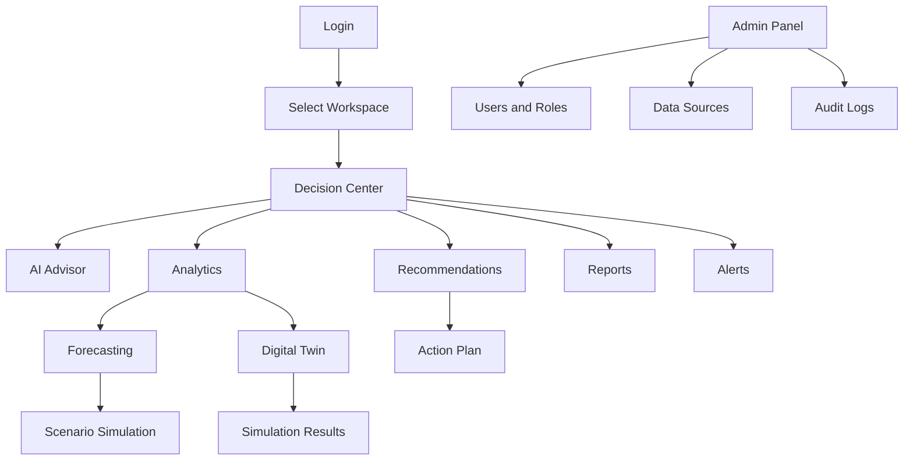
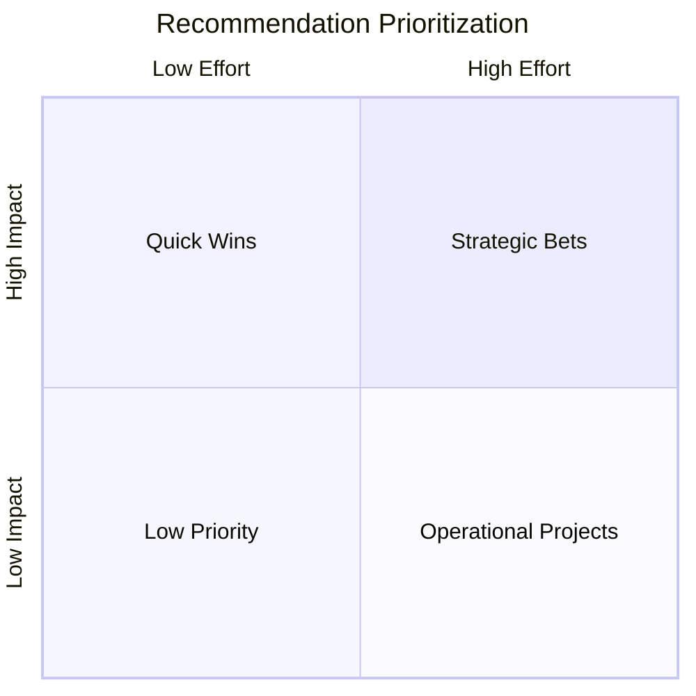

# UI/UX Platform Generation Prompt

## AI Business Decision Intelligence Platform

Use this prompt to generate the complete UI/UX design and frontend product experience for the AI Business Decision Intelligence Platform.

---

## Master Prompt

You are a Principal Product Designer, Senior UX Architect, Enterprise SaaS UI Designer, Accessibility Specialist, and Senior Frontend Engineer.

Design a production-ready AI Business Decision Intelligence Platform.

The platform is not a traditional dashboard tool. It is an AI-first business advisor that helps companies understand what changed, why it changed, what will happen next, what risks exist, and what actions should be taken.

The UI must feel enterprise-grade, calm, intelligent, trustworthy, and highly usable for founders, executives, analysts, finance teams, sales leaders, operations teams, and customer success teams.

Do not design a marketing landing page. Design the actual product interface.

---

## Product Context

The platform ingests business data from spreadsheets, CRMs, finance tools, ecommerce systems, support tools, documents, and databases. It uses AI agents to clean data, detect anomalies, identify root causes, forecast future trends, simulate business scenarios through a digital twin, recommend actions, generate executive reports, and alert users about risks.

The core product promise:

> "An AI Business Advisor that explains business performance, predicts what comes next, simulates strategic options, and recommends evidence-backed actions."

---

## Design Goals

Create a complete UI/UX design covering:

- Complete Information Architecture
- Navigation Flow
- Dashboard Layout
- AI Chat Interface
- Analytics Screens
- Recommendation Center
- Digital Twin
- Forecasting
- Alerts
- Reports
- Admin Panel
- Mobile Responsiveness
- Accessibility Guidelines
- Design System
- Color Palette
- Typography
- Component Library

The output should include screen descriptions, layout structure, component behavior, user flows, responsive behavior, accessibility requirements, and design system specifications.

---

## 1. Complete Information Architecture

Design the application information architecture with the following primary product areas:

1. Decision Center
2. AI Advisor
3. Analytics
4. Recommendations
5. Digital Twin
6. Forecasting
7. Alerts
8. Reports
9. Data Sources
10. Knowledge Base
11. Admin
12. Settings

For each area, define:

- Purpose
- Main users
- Key screens
- Primary actions
- Secondary actions
- Required data
- Empty states
- Error states
- Loading states
- Permission states

Recommended IA structure:

```text
App
  Decision Center
    Overview
    Priority Insights
    Risk Summary
    Recommended Actions
    Business Health Score
  AI Advisor
    Chat Workspace
    Evidence Panel
    Decision History
    Saved Questions
  Analytics
    Revenue Analytics
    Customer Analytics
    Sales Analytics
    Marketing Analytics
    Operations Analytics
    Support Analytics
    Custom Metrics
  Recommendations
    Recommendation Inbox
    Impact vs Effort Matrix
    Action Plans
    Accepted Actions
    Outcome Tracking
  Digital Twin
    Business Model
    Scenario Builder
    Simulation Results
    Assumptions
    Sensitivity Analysis
  Forecasting
    Revenue Forecast
    Demand Forecast
    Churn Forecast
    Cash Flow Forecast
    Model Confidence
  Alerts
    Active Alerts
    Alert Rules
    Escalations
    Notification Settings
  Reports
    Executive Summary
    Weekly Business Review
    Board Report
    Custom Reports
    Scheduled Reports
  Data Sources
    Uploads
    Connectors
    Sync Status
    Data Quality
    Semantic Metrics
  Knowledge Base
    Documents
    Business Definitions
    Metrics Catalog
    Decision Memory
  Admin
    Users
    Roles
    Permissions
    Audit Logs
    Billing
    Security
  Settings
    Workspace
    Profile
    Integrations
    AI Preferences
    Notifications
```

---

## 2. Navigation Flow

Design a navigation system optimized for enterprise SaaS workflows.

Desktop navigation:

- Left persistent sidebar.
- Top utility bar.
- Workspace switcher.
- Global search.
- AI Advisor quick-launch button.
- Notification center.
- User/account menu.

Mobile navigation:

- Bottom navigation for top 4-5 sections.
- Collapsible full-screen menu for advanced sections.
- Sticky AI Advisor action.
- Responsive cards and tables.

Primary navigation items:

1. Decision Center
2. AI Advisor
3. Analytics
4. Recommendations
5. Digital Twin
6. Forecasting
7. Alerts
8. Reports
9. Data Sources
10. Admin

Navigation behavior:

- Show active section clearly.
- Support breadcrumbs for deep pages.
- Support saved views.
- Support recent items.
- Support role-based visibility.
- Use icons with accessible labels.
- Avoid visual clutter.

Include a Mermaid navigation flow:



---

## 3. Dashboard Layout

Design the Decision Center as the primary landing screen after login.

Dashboard purpose:

- Summarize business health.
- Surface urgent risks.
- Explain top metric changes.
- Recommend next best actions.
- Provide direct entry into AI Advisor.

Desktop layout:

- Top row: workspace name, date range selector, compare period, refresh/sync state.
- KPI band: revenue, profit margin, churn, pipeline, cash flow, customer sentiment.
- Business Health Score panel.
- Priority Insights feed.
- AI Advisor prompt panel.
- Recommendations preview.
- Risk and Alerts panel.
- Forecast snapshot.
- Data quality indicator.

Layout wireframe:

```text
 ---------------------------------------------------------------
| Top Bar: Workspace | Search | AI Advisor | Alerts | Profile    |
 ---------------------------------------------------------------
| Sidebar | Decision Center                                  |
|         | Date Range | Compare | Export | Refresh           |
|         |---------------------------------------------------|
|         | KPI 1 | KPI 2 | KPI 3 | KPI 4 | KPI 5 | KPI 6      |
|         |---------------------------------------------------|
|         | Business Health       | Priority Insights          |
|         | Score + Drivers       | Ranked AI explanations     |
|         |---------------------------------------------------|
|         | AI Advisor Prompt     | Recommendations            |
|         | Ask about your data   | Impact / Effort / Risk      |
|         |---------------------------------------------------|
|         | Forecast Snapshot     | Alerts and Risks            |
|         | Trend + confidence    | Active alerts               |
 ---------------------------------------------------------------
```

Dashboard components:

- KPI cards with trend direction, variance, confidence, and data freshness.
- Insight cards with title, why it matters, evidence count, confidence score, and suggested action.
- Risk cards with severity, affected metric, and recommended mitigation.
- Recommendation cards with impact, effort, risk, owner, and status.
- Forecast preview with confidence interval.
- Data quality badge.

---

## 4. AI Chat Interface

Design an AI Advisor chat interface that feels like an executive analyst, not a generic chatbot.

Core layout:

- Main conversation area.
- Right-side evidence panel on desktop.
- Collapsible evidence drawer on mobile.
- Suggested prompts.
- Tool progress timeline.
- Source citations.
- Confidence and caveats.
- Follow-up actions.

AI chat must support:

- Natural language business questions.
- Streaming responses.
- Tool-call progress updates.
- Suggested follow-up questions.
- Evidence panel.
- Generated charts.
- Generated tables.
- Action recommendations.
- Save to report.
- Convert answer into alert.
- Convert recommendation into action plan.

AI chat message structure:

- User question.
- AI answer summary.
- Key findings.
- Evidence citations.
- Confidence score.
- Caveats.
- Recommended next actions.
- Follow-up questions.

Example interaction:

```text
User: Why did revenue drop last month?

AI Advisor:
Revenue dropped 12.4% mainly because enterprise renewals declined in the West region and paid search conversion fell after campaign spend was reduced.

Top drivers:
1. Enterprise renewals down 18.2%
2. West region sales cycle extended by 9 days
3. Paid search conversion down 21.5%

Recommended action:
Prioritize renewal outreach for 34 at-risk enterprise accounts and restore spend to the two highest-performing paid search campaigns.

Confidence: 82%
Evidence: 7 metrics, 3 documents, 2 CRM segments
```

AI chat UX requirements:

- Always distinguish facts, assumptions, forecasts, and recommendations.
- Show evidence inline and in the evidence panel.
- Do not hide uncertainty.
- Use calm, concise language.
- Allow users to challenge the answer.
- Allow users to inspect generated SQL or metric lineage if permitted.

---

## 5. Analytics Screens

Design analytics screens for business metrics with AI-enhanced analysis.

Core analytics screen structure:

- Page title and metric domain.
- Date range and comparison controls.
- Filters and segment selectors.
- Metric summary cards.
- Trend chart.
- Breakdown table.
- AI-generated insights.
- Root-cause panel.
- Related recommendations.
- Export and report actions.

Analytics domains:

- Revenue Analytics
- Customer Analytics
- Sales Analytics
- Marketing Analytics
- Operations Analytics
- Support Analytics
- Financial Analytics

Analytics components:

- Metric cards.
- Line charts.
- Bar charts.
- Funnel charts.
- Cohort tables.
- Heatmaps.
- Segment comparison tables.
- Root-cause driver cards.
- Data freshness banners.
- Drilldown drawers.

Behavior:

- Users can ask AI about any metric.
- Users can drill from metric to segment to source evidence.
- Users can save views.
- Users can export data and charts.
- Users can create alerts from metric thresholds.

---

## 6. Recommendation Center

Design a Recommendation Center that turns insights into prioritized actions.

Main sections:

- Recommendation Inbox
- High Impact Actions
- Quick Wins
- Risk Mitigation
- Strategic Bets
- Accepted Actions
- Rejected Recommendations
- Outcome Tracking

Recommendation card fields:

- Title
- Business objective
- Expected impact
- Confidence
- Effort
- Risk
- Time to impact
- Evidence count
- Owner
- Status
- Due date
- Related metrics

Views:

- List view
- Kanban view
- Impact vs effort matrix
- Risk-ranked view
- Owner workload view

Actions:

- Accept recommendation.
- Reject recommendation.
- Request more evidence.
- Simulate impact.
- Assign owner.
- Add due date.
- Convert to action plan.
- Track outcome.

Include impact-effort matrix:



---

## 7. Digital Twin

Design a Digital Twin module that models the business and simulates scenarios.

Purpose:

- Represent key business drivers and dependencies.
- Simulate what-if scenarios.
- Compare strategic options.
- Show sensitivity of outcomes.

Core screens:

- Business Model Map
- Scenario Builder
- Simulation Results
- Assumptions
- Sensitivity Analysis
- Saved Scenarios

Digital Twin components:

- Business driver graph.
- Metric dependency map.
- Scenario sliders.
- Assumption table.
- Simulation result cards.
- Side-by-side scenario comparison.
- Sensitivity tornado chart.
- Confidence and risk indicators.

Example scenarios:

- What happens if marketing spend increases by 15%?
- What happens if churn decreases by 2%?
- What happens if supplier costs rise by 8%?
- What happens if sales cycle length increases by 10 days?

Digital Twin UX:

- Keep simulation controls understandable for non-technical users.
- Clearly label assumptions.
- Show projected impact on revenue, cash flow, margin, churn, and capacity.
- Allow users to save scenarios and attach them to reports.

---

## 8. Forecasting

Design Forecasting screens for predictive business planning.

Core screens:

- Forecast Overview
- Metric Forecast Detail
- Model Confidence
- Forecast Drivers
- Forecast Comparison
- Forecast Alerts

Forecasting UI components:

- Forecast line chart with confidence band.
- Historical vs forecast toggle.
- Scenario overlay.
- Forecast driver cards.
- Model quality panel.
- Error metrics.
- Assumption list.
- Forecast explanation.

Required forecasts:

- Revenue forecast
- Cash flow forecast
- Churn forecast
- Demand forecast
- Pipeline forecast
- Support volume forecast

Forecasting UX requirements:

- Never show a forecast without uncertainty.
- Always show data freshness.
- Explain major drivers.
- Show historical forecast accuracy when available.
- Allow users to ask AI about forecast assumptions.

---

## 9. Alerts

Design an Alerts module for proactive monitoring.

Alert types:

- Metric threshold alert.
- Anomaly alert.
- Forecast risk alert.
- Data quality alert.
- Connector failure alert.
- Recommendation follow-up alert.
- Security or admin alert.

Alert screens:

- Active Alerts
- Alert Detail
- Alert Rules
- Escalation Policies
- Notification Settings
- Alert History

Alert card fields:

- Severity
- Title
- Affected metric
- Detected time
- Business impact
- Evidence
- Recommended action
- Owner
- Status

Alert statuses:

- New
- Acknowledged
- Investigating
- Resolved
- Dismissed

Alert UX:

- Use severity colors carefully.
- Avoid overwhelming users with noise.
- Allow grouping related alerts.
- Allow converting alerts into recommendations or action plans.
- Provide snooze and escalation options.

---

## 10. Reports

Design Reports for executive and operational communication.

Report types:

- Executive Summary
- Weekly Business Review
- Monthly Business Review
- Board Report
- Investor Update
- Sales Performance Report
- Customer Health Report
- Risk Report
- Custom AI Report

Report builder features:

- AI-generated narrative.
- Editable sections.
- Chart insertion.
- Insight insertion.
- Recommendation insertion.
- Evidence references.
- Export to PDF.
- Share link.
- Schedule delivery.
- Approval workflow.

Report layout:

- Executive summary.
- KPI highlights.
- What changed.
- Why it changed.
- What is forecasted.
- Key risks.
- Recommended actions.
- Evidence appendix.

---

## 11. Admin Panel

Design an Admin Panel for workspace governance.

Admin sections:

- Users
- Roles and Permissions
- Workspaces
- Data Sources
- Connectors
- Semantic Metrics
- AI Settings
- Audit Logs
- Billing and Usage
- Security
- Notification Policies

Admin UX requirements:

- Make permission changes explicit and auditable.
- Show role impact before saving.
- Show data source health.
- Show token usage and AI cost.
- Show model provider settings.
- Support enterprise SSO settings.
- Support audit log filtering and export.

Admin tables:

- Users table.
- Roles table.
- Data source table.
- Audit events table.
- Usage table.
- Connector sync jobs table.

---

## 12. Mobile Responsiveness

Design mobile layouts for executives and managers who need quick decisions on the go.

Mobile priorities:

- Decision Center summary.
- AI Advisor chat.
- Alerts.
- Recommendations.
- Reports preview.

Mobile rules:

- Use bottom navigation for primary actions.
- Collapse sidebar into full-screen menu.
- Convert wide tables into cards.
- Use horizontal scrolling only for charts when necessary.
- Keep filters in bottom sheets.
- Make evidence panel a slide-up drawer.
- Keep touch targets at least 44px.
- Maintain readable chart labels.
- Support portrait first, landscape second.

Responsive breakpoints:

| Breakpoint | Width | Behavior |
|---|---:|---|
| Mobile | 320-767px | Single column, bottom nav, drawers |
| Tablet | 768-1023px | Two-column layouts, collapsible sidebar |
| Desktop | 1024-1439px | Full sidebar, multi-column dashboard |
| Wide | 1440px+ | Expanded panels, persistent evidence sidebars |

---

## 13. Accessibility Guidelines

Follow WCAG 2.2 AA.

Accessibility requirements:

- All interactive elements must be keyboard accessible.
- Provide visible focus states.
- Use semantic HTML landmarks.
- Provide accessible names for icons and buttons.
- Maintain sufficient color contrast.
- Do not communicate status by color alone.
- Support reduced motion.
- Provide chart data tables or summaries.
- Provide screen-reader-friendly AI streaming updates.
- Make modals, drawers, menus, and tooltips accessible.
- Use clear error messages and form validation.
- Ensure touch targets are large enough.

AI-specific accessibility:

- AI responses should have clear headings and structured sections.
- Evidence citations should be keyboard navigable.
- Confidence and caveats should be text-readable, not only visual.
- Streaming text should not trap screen readers.
- Charts generated by AI should include summaries.

---

## 14. Design System

Create a complete design system for an enterprise AI analytics product.

Design principles:

- Calm intelligence.
- Evidence before persuasion.
- Dense but readable information.
- Clear hierarchy.
- Trustworthy AI.
- Fast scanning.
- Human control.

Visual style:

- Clean enterprise SaaS.
- Subtle depth.
- Minimal decoration.
- Sharp information hierarchy.
- Rounded corners should be restrained, preferably 6-8px.
- Avoid playful or overly decorative visuals.
- Use color intentionally for state and meaning.

Spacing:

- Base spacing unit: 4px.
- Common spacing: 4, 8, 12, 16, 24, 32, 48.
- Dashboard card padding: 16-20px.
- Dense table cell padding: 8-12px.
- Page max width: responsive, with full-width enterprise layouts.

Elevation:

- Use subtle borders more than heavy shadows.
- Cards should use light borders.
- Critical overlays may use soft shadows.

---

## 15. Color Palette

Create a color palette that feels analytical, modern, and trustworthy.

Avoid a one-note palette. Do not make the interface dominated by purple, beige, dark navy, or bright gradients.

Recommended palette:

| Role | Color | Usage |
|---|---|---|
| Background | `#F8FAFC` | App background |
| Surface | `#FFFFFF` | Cards, panels, tables |
| Surface Muted | `#F1F5F9` | Secondary sections |
| Border | `#CBD5E1` | Dividers and card borders |
| Text Primary | `#0F172A` | Main text |
| Text Secondary | `#475569` | Supporting text |
| Text Muted | `#64748B` | Metadata |
| Primary | `#2563EB` | Main actions and links |
| Primary Hover | `#1D4ED8` | Hover state |
| Accent Teal | `#0F766E` | Positive analytical highlights |
| Accent Indigo | `#4F46E5` | AI-specific indicators |
| Success | `#16A34A` | Positive state |
| Warning | `#D97706` | Caution state |
| Danger | `#DC2626` | Critical state |
| Info | `#0284C7` | Informational state |

Chart palette:

- Blue: `#2563EB`
- Teal: `#0F766E`
- Amber: `#D97706`
- Rose: `#E11D48`
- Violet: `#7C3AED`
- Cyan: `#0891B2`
- Green: `#16A34A`
- Slate: `#475569`

Color rules:

- Use red only for true negative or destructive states.
- Use green only for positive business states.
- Use amber for warnings and moderate confidence.
- Use blue for primary navigation and actions.
- Use indigo sparingly for AI identity.

---

## 16. Typography

Use a professional, highly readable sans-serif type system.

Recommended font stack:

```css
font-family: Inter, ui-sans-serif, system-ui, -apple-system, BlinkMacSystemFont, "Segoe UI", sans-serif;
```

Type scale:

| Token | Size | Weight | Usage |
|---|---:|---:|---|
| Display | 32px | 700 | Rare page-level executive summaries |
| H1 | 28px | 700 | Page titles |
| H2 | 22px | 650 | Section headings |
| H3 | 18px | 650 | Card and panel headings |
| Body | 14px | 400 | Main UI text |
| Body Strong | 14px | 600 | Emphasis |
| Small | 12px | 400 | Metadata |
| Caption | 11px | 500 | Labels and badges |

Typography rules:

- Do not use negative letter spacing.
- Avoid oversized hero-style typography inside app screens.
- Keep dashboard text compact and scannable.
- Use tabular numbers for KPIs and tables.
- Ensure long labels wrap cleanly.

---

## 17. Component Library

Design a reusable component library.

### Navigation Components

- Sidebar navigation
- Top bar
- Breadcrumbs
- Workspace switcher
- Global search
- Command palette
- Notification menu
- User profile menu

### Data Display Components

- KPI card
- Insight card
- Recommendation card
- Risk card
- Forecast card
- Data quality badge
- Confidence badge
- Evidence citation
- Metric lineage viewer
- Audit timeline
- Empty state

### Analytics Components

- Line chart
- Bar chart
- Stacked bar chart
- Funnel chart
- Heatmap
- Cohort table
- Comparison table
- Breakdown table
- Forecast chart with confidence interval
- Driver analysis panel

### AI Components

- AI chat message
- User chat message
- Streaming response
- Tool progress stepper
- Suggested prompt chips
- Evidence panel
- Confidence indicator
- Caveat banner
- Follow-up question list
- AI-generated table
- AI-generated chart

### Form Components

- Text input
- Search input
- Select
- Multi-select
- Date range picker
- Toggle
- Checkbox
- Radio group
- Slider
- Number input
- File upload
- Connector setup form
- Scenario assumption editor

### Feedback Components

- Toast
- Inline alert
- Modal
- Drawer
- Confirmation dialog
- Loading skeleton
- Progress indicator
- Error state
- Success state
- Warning banner

### Admin Components

- User table
- Role editor
- Permission matrix
- Audit log table
- Usage meter
- Billing plan card
- Connector health card
- API key manager

Component requirements:

- Every component must include default, hover, focus, active, disabled, loading, empty, and error states where relevant.
- Components must support dark mode later, but light mode is the default.
- Components must support role-based visibility and permission-disabled states.
- Components must be responsive.
- Components must meet WCAG 2.2 AA.

---

## 18. Screen Inventory

Generate detailed designs for these screens:

1. Login
2. Workspace Selection
3. Decision Center Dashboard
4. AI Advisor Chat
5. Evidence Panel
6. Revenue Analytics
7. Customer Analytics
8. Sales Analytics
9. Marketing Analytics
10. Operations Analytics
11. Recommendation Center
12. Recommendation Detail
13. Digital Twin Business Model
14. Scenario Builder
15. Simulation Results
16. Forecast Overview
17. Forecast Detail
18. Alerts Inbox
19. Alert Detail
20. Reports Home
21. Executive Report Editor
22. Data Sources
23. Data Quality
24. Metrics Catalog
25. Admin Users
26. Roles and Permissions
27. Audit Logs
28. Billing and Usage
29. Settings
30. Mobile Decision Center
31. Mobile AI Advisor
32. Mobile Alerts

For every screen, provide:

- Goal
- Main user
- Layout
- Components
- Primary action
- Secondary actions
- Empty state
- Loading state
- Error state
- Accessibility notes
- Mobile behavior

---

## 19. Interaction Principles

- Keep the user in control of AI-generated recommendations.
- Make evidence easy to inspect.
- Show progress when AI agents are working.
- Make uncertainty visible but not alarming.
- Let users drill down from summary to evidence.
- Let users turn insights into actions.
- Let users save, share, and report important findings.
- Avoid overwhelming dashboards with too many charts.
- Prioritize decisions, risks, and recommended actions.

---

## 20. Final Output Required

Produce the final UI/UX specification with:

1. Product UX summary
2. Complete information architecture
3. Navigation model
4. User flows
5. Screen-by-screen layouts
6. Dashboard layout
7. AI chat interface design
8. Analytics screens
9. Recommendation Center
10. Digital Twin screens
11. Forecasting screens
12. Alerts screens
13. Reports screens
14. Admin Panel
15. Mobile responsive design
16. Accessibility guidelines
17. Design system
18. Color palette
19. Typography
20. Component library
21. Mermaid diagrams where appropriate
22. Implementation notes for frontend engineers

The design must be practical enough for engineers to build and polished enough for enterprise SaaS users to trust.
